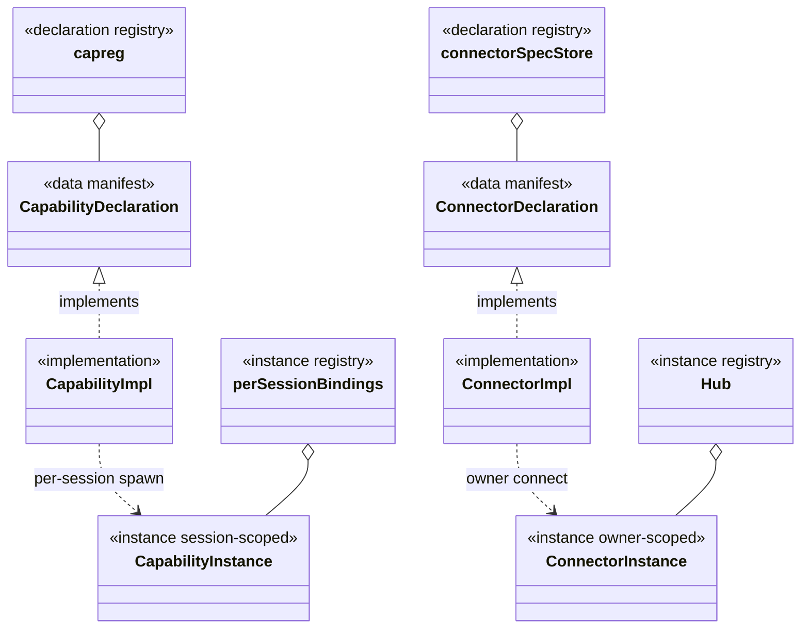
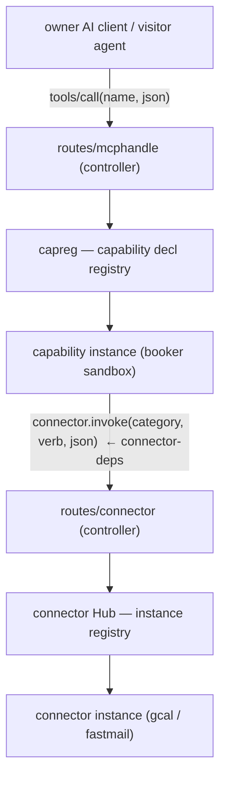

# Backend domain modules — package by domain, dissolve the layer god-packages

**Status:** the three god-packages are **dissolved** (2026-07-27); the remaining open items are
the connector-specific steps 2-4 below. Supersedes the ad-hoc socket-op placement and the typed
`contract.CalendarProxy` category surface. Companion vault node:
`[[backend-domain-modules]]` under `[[structure]]`.

`internal/` now holds exactly the class-diagram set and nothing else: the 8 core domain modules
(corpus · conversation · connector · access · owner · security · marketplace · stats) plus
`capabilities` (the capability axis), `routes` (the real inbound controllers) and `infra` (the
domain-less shared base). `check-internal-dirs.sh` enforces this with an EMPTY baseline, i.e. in
pure-red mode: any other directory under `internal/` fails the build, with nothing grandfathered.

## The disease — three god-packages sliced by *layer* (cured)

The backend was packaged **by layer**, so every domain's pieces were scattered across three
buckets that only grew:

```
internal/usecases  (106 files)  ← every domain's usecase dumped together   [dissolved]
internal/domain    ( 55 files)  ← every domain's entity dumped together    [dissolved]
internal/postgres  ( 66 files)  ← every domain's repo dumped together      [dissolved]
```

All three are gone. `internal/plugins` — which had become a fourth such bucket for the
owner-side capability code — is gone with them: `plugins/booker` split into `owner/entity` +
`owner/usecase` (bookings are the owner's calendar) and `plugins/ownercore` became
`owner/ownercore`, an owner sub-module next to `owner/jobs`.

Consequences:

- **Reverse dependencies.** `internal/connector/slots.go` imports `internal/usecases`
  (`usecases.AgentToolConnector`, `usecases.ErrMailNotConfigured`) — a domain depending
  *upward* on the god-package for its **own** concepts, because those concepts have no
  home in the connector domain.
- **A capability that wants its own {entity + usecase + repo} must cross all three buckets.**
- **A typed category surface in Go.** `contract.CalendarProxy` (`FreeBusy/InsertEvent/…`) is a
  compile-time interface: adding a category/verb needs a recompile, and it is exactly the
  "typed category handle" that #135 forbids the kernel to hold.

## The principle — package by domain

Each **domain** becomes a self-contained module `internal/<domain>/` that owns its full
vertical — **entity + usecase + repo + a public interface** — and exposes *only* that public
interface to the rest of the system. A domain's own usecases live in the domain, not in a
global bucket. Shared layers are allowed **only** for things that genuinely belong to *no*
domain (see [Shared infra](#shared-infra-truly-domain-less)); the moment "shared" holds a
domain-specific thing it is a god-package again.

## Controllers — the real entry layer

`internal/routes/*` is the real, backend-wide **controller** layer (`server.go` assembles
chi, does zero business). It handles **all** inbound traffic and delegates to domain-module
public interfaces:

| controller | inbound | delegates to |
|---|---|---|
| `routes/admin` · `public` · `sys` · `pubapi` | HTTP | domain usecases |
| `routes/mcphandle` | owner MCP (`/mcp`) | `capreg` (capability axis) |
| `routes/connector` | sandbox↔host socket bridge | `connector.invoke` (connector axis) |

A domain module's "internal controller" is **not** a controller — it is the module's public
facade. Only `routes/*` are controllers.

## The two plugin axes — one meta-structure

Two axes of externally-provided functionality. **They are the same abstraction**, differing
*only* in the call convention:

```
{ declaration (data) → implementation → instance → ONE opaque call door }
```

- **declaration** — a **data** manifest **that lives OUTSIDE `internal/`** (top-level
  `connectors/`, discovered from disk, or owner-registered). Says what a thing *is*: a category
  and its verbs + schemas, or a capability and its tools + schemas. **Never a Go interface, never
  in `internal/`.**
  - Today `connectors/<provider>/manifest.yaml` declares *providers* (implementations, each
    tagged `category`), but the **category declaration itself** is still hardcoded in `internal/`
    as the `calendarVerbs`/`mailVerbs` maps (`internal/connector/invoke.go`) + the typed
    `contract.CalendarProxy`/`MailProxy` interfaces. That is the un-migrated typed-category
    surface: the category declaration (verbs + schemas) must become a **data** file under
    top-level `connectors/`, and `internal/` keeps only the generic verb-by-name dispatch.
- **implementation** — the adapter/plugin that satisfies a declaration (an OpenAPI/protocol
  connector adapter; a capability's MCP-server binary).
- **instance** — the runtime, scoped, invoke-able thing. Its **scope differs by axis**:
  connector instance = **owner-persistent** (a connected account + creds); capability instance
  = **session-ephemeral** (a per-session cold-spawned sandbox).
- **one opaque call door** — each axis has exactly one generic entry, keyed by name, opaque
  JSON in/out. No typed surface; the callee never sees the caller.



### Two registries per axis (a declaration registry ≠ an instance registry)

`capreg` is a **declaration** registry (it holds capability types); its true counterpart is the
**connector spec store**, *not* the `Hub`. The `Hub` is the connector **instance** registry;
its counterpart is the per-session capability bindings.

| | declaration registry (types) | instance registry (runtime) |
|---|---|---|
| capability axis | `capreg` — boot plugins + owner-registered MCP / installed skill | per-session cold-spawned sandbox bindings |
| connector axis | connector spec store — boot built-ins + owner-uploaded spec | `Hub` (owner's connected accounts + creds) |

### Owner has both a type path and an instance path — on both axes

Registration is **not** boot-only; the owner extends the type set at runtime, then makes
instances:

| | register a **type** (declaration) | create an **instance** |
|---|---|---|
| connector | `POST /connectors` (`+ /validate-spec`) → `Hub.Upsert` an uploaded OpenAPI spec | `POST /{id}/credentials` + `/connect` + `/activate` |
| capability | `POST /mcp-servers` (external MCP server) · marketplace `InstallSkill` | per-session sandbox spawn (+ enable/disable gate) |

### The two call doors, and where they touch



- **Calling a capability:** `tools/call(toolName, json)` — one door (mcphandle + sandbox dial).
- **Calling a connector:** `connector.invoke(category, verb, json)` — one door
  (`routes/connector` controller → `Slots.Invoke`).
- **The only cross-axis edge is `connector-deps`:** a capability *instance* (booker), at
  runtime, calls the connector door. Capabilities sit above connectors; a capability reaches
  *down* to a connector, never the reverse. The connector never asks `capreg` for anything.

### Why category (not a specific provider name)

StandMeet is **self-hosted**: each owner brings their own calendar/mail (Google, Fastmail,
self-hosted CalDAV/SMTP). The platform cannot pick a provider. So a capability programs against
a **category** (`calendar`) — a swappable interface — and the owner binds a concrete provider as
the active instance. Swap the provider → rebind `(owner, category) → active instance`; the
capability is unchanged. Category also groups the verb contract and keeps credentials on the
connector side. (For a single instance hardcoded to one provider this whole indirection is
unnecessary — it exists *because* the product is BYO-integration.)

## Domain inventory

### Core domain modules (`internal/<domain>/`, each owns entity+usecase+repo+public)

| module | absorbs (from the three god-packages) |
|---|---|
| **corpus** | raw / wiki / output / writing(s) / note / tree_node / citation / subjectivity / crosslink / seo / content — **+ search (Meili) as its retrieval infra** |
| **conversation** | chat / dialog / message / conversation_ghost / visitor-session assembly — **+ inference as its agent engine** |
| **connector** | connection / integration / mail_connector / **connectorsvc (its admin/lifecycle)** + adapters. (Its registry/door move to the platform axes, below.) |
| **access** | access_code / access_request / role / role_snapshot / dock_buttons / path_acl / api_key **(+ session)** |
| **owner** | owner / account / instance / app_state / page_content / microsite / appearance / keypair / login / password / recovery **+ mail (mail_otp / outbound) + prompts** |
| **security** | captcha / banned_ip / login-guard · anti-replay (auth = access; **protection = security**) |
| **marketplace** | marketplace / skill / mcp_server |
| **stats** (observability) | stats_activity / growth / jobs / inference_usage / system_info |

### Fully externalized capabilities (sandboxed plugins — **not** core domains)

`booker` · `retrieval` · `summarize` · **`report`** · `ask-visitor` · `mail-sender` ·
`ownercore` · `jobs`.

### Shared infra (truly domain-less)

`capsocket` (bare transport) · `pgxpool` (raw pool, ≠ the 66 repos) · `cryptobox` · `httpx` ·
`retry` · `storage` · `gotenberg` · `sandbox`/`sandboxws` · `config` · `apierr`.

### Platform mechanism (the plugin底座, not a domain)

`capreg` (+ the connector declaration/instance registries — the two axes) · `plugins` ·
`paritymanifest` · `facadeparity`.

## What dies

- `internal/usecases` (106) / `internal/domain` (55) / `internal/postgres` (66) as god-packages —
  contents redistributed into the domain modules above.
- `contract.CalendarProxy` and any typed category surface — the declaration becomes **data**.
- `connector → usecases` reverse dependency — `AgentToolConnector` / `ErrMailNotConfigured`
  move back into the connector domain.
- Naming: `capreg` → *capability declaration registry*; `connector.Hub` → *connection (instance)
  registry*; the socket-op handlers move to `internal/routes/<domain>/` (controllers).

## Externalization is not relocation — the booker lesson

A capability is externalized only when the **host keeps none of its logic**. Moving the host copy
to a tidier address inside `internal/` passes every structural gate and changes nothing: the gates
measure shape, and a semantic duplicate has a perfectly legal shape.

That is what had happened to booker. `mcp-servers/booker/policy.go` (187 lines) and the kernel's
booking policy evaluator (167 lines) were two independent implementations of the same rules — same
conflict tokens, same slot-enumeration constants — and each file's header asserted the *other* side
owned it (`核心不再认识 booking policy`, `host 认不得 booking`). Both statements were false.

The root cause was a mechanism gap, not carelessness: a sandboxed capability could only face
visitors (`OwnerMCPBindings()` returned an empty slice), so any owner-facing surface of the same
capability *had* to be reimplemented host-side. Fixed by `mcpplugin.Manifest.OwnerTools` —
owner tools as declaration **data**, enumerable at assembly time, with the sandbox dialed only on
invocation.

Two defects fell out of it immediately, and both are the reason this matters:

- Only the host binary imported `time/tzdata`. With the evaluator in the sandbox, every named IANA
  zone failed to load and `list_slots` returned an **empty list** — indistinguishable from "the
  owner has no availability". A duplicate does not just risk drift; it hides which copy carries the
  environment the algorithm needs.
- The two copies had different error conventions (MCP `isError` vs a `{ok:false,error,detail}`
  payload), so externalizing one changed the owner-facing contract.

**Still owed (the cancel cluster).** `owner/usecase/booking_cancel.go` and
`booking_cancel_own.go` still duplicate `mcp-servers/booker/cancel.go`'s `deleteBooking`
(delete the calendar event, then delete the capstore record). Only the *lookup* differs — owner
resolves by `booking_id`, the sandbox by conversation + `event_id`. The externalization is:

1. add an owner-scoped `calendar_cancel_booking` tool to the sandbox, resolving by booking id and
   reusing its existing `deleteBooking`;
2. declare it in `OwnerTools` and drop ownercore's `cancelBookingBinding`;
3. point `POST /api/v1/booking-cancellation` (the deterministic visitor card action — a legitimate
   host *controller*) at the sandbox's `calendar_cancel` with the visitor session context, which is
   exactly what its `resolveConvBooking` already expects;
4. delete both host usecases. `entity/booking.go` keeps only the types the admin surfaces read.

## Owed: ownercore is the fourth god-package, relocated not dissolved

`internal/owner/ownercore` is 49 files importing **every** domain — corpus 14, access 9,
marketplace 6, connector 5, conversation 2, stats 1, security 1. It is not owner's domain logic; it
is the whole product's owner-MCP **tool surface**. Moving it from `internal/plugins/ownercore` to
`internal/owner/ownercore` gave a god-package a tidier address, the same mistake the booker cluster
got (see above).

The tell: it is the sole reason `check-domain-acyclic` had to learn about own-boundary sub-modules.
An aggregator that legitimately spans domains would otherwise forge `owner -> conversation` and
close a cycle against the pre-existing `conversation -> owner`. That special case treats the
symptom.

This doc is also self-contradictory here: it sanctions `ownercore` under **owner** (as an
in-process, non-sandboxed owner-side cap) while its own owner inventory is
account/instance/page/microsite/appearance/keypair/login/password/recovery + mail + prompts —
which is not "every other domain's MCP tools". And the principle above says controllers are **only**
`internal/routes/*`; an inbound owner-MCP tool surface is a controller.

**Decided (owner, 2026-07-30):** *"ownercore 应该由各个模块自己 facade 出,然后从 route 绑出到
MCP 上。"* So `ownercore` does not shrink — it **disappears**:

- each domain exposes its own owner-MCP bindings **through its own facade** (`cap_corpus_*` → the
  corpus facade, `cap_roles`/`cap_codes` → access, `cap_marketplace` → marketplace, `cap_page`/
  `cap_account`/… → owner, and so on);
- the **route layer** binds those onto the MCP surface — which is where a controller belongs, per
  this doc's own "controllers are only `internal/routes/*`";
- `internal/owner/ownercore/` ceases to exist; no domain holds another domain's tools.

Falsifiable check that it actually worked (not just moved): the cross-domain edges disappear, so the
own-boundary sub-module special case can be **deleted** from `check-domain-acyclic` and the gate
still passes. If the special case is still needed, the aggregator is still there under a new name.

## Owed: AI credentials cross the owner facade in plaintext

`owner/entity/ai_credential.go` holds `AICredential{Provider, Key, Model, Endpoint}` where `Key` is,
per its own comment, a **plaintext API key** — and `owner/facade/facade_entity.go` re-exports it, so
`routes/public/{byoai_envelope,agent_turn,llm_chat_stream}.go` and
`conversation/inference/resolver.go` all hold it. The type carries no protection: no redacting
`String()`, no `MarshalJSON` mask, so one `slog` call or wrapped error puts the key in the logs.

This is the same invariant the connector layer states loudly and keeps ("凭据永不出 vault";
capabilities get handles, never secrets) — AI keys are the double standard. The BYOAI path genuinely
needs the visitor's own key to reach inference, but the file's "one struct covers both paths" note is
the problem: the owner's **decrypted vault secret** rides the same public type.

**Target:** the secret stops crossing the facade — the resolver hands back an already-bound call
door (or inference construction moves inside the credential boundary), and routes only pass the
BYOAI envelope. Minimum stop-gap if that is deferred: redacting `String()`/`MarshalJSON` so it can
never be logged by accident.

## The dispatcher — one outbound convergence point (decided 2026-07-30)

Named by the owner: **`dispatcher`** (`internal/routes/dispatcher`). It is **not** an "owner"
registry — it has nothing to do with the owner *domain*, and it is not a second `capreg`.

Everything that goes OUT converges here, all of it protocol-agnostic:

1. **domain operations** — each domain's facade exposes plain functions (`CreateRole(ctx, in)`);
   the domain never learns whether it is served over MCP, HTTP, IM or an SDK;
2. **connector capabilities** — the connector axis's category+verb surface;
3. **capreg capabilities** — the agent-loadable ones, where they surface outward.

Every face is then a **projection** of the dispatcher: MCP is *generated* (walk it, so there is no
hand-written step to forget), HTTP admin is *verified* (hand-written REST shapes, cross-checked).
Parity stops being a table someone maintains and becomes a property of the structure.

Why this shape is forced: `capreg` imports `access/facade`, so a domain that reaches for `capreg`
to declare its own tools closes an import cycle. The domain must therefore stay protocol-free and
the adaptation must live at the dispatcher.

**The missing gate.** Nothing today stops a face from reaching past the dispatcher: `routes/admin`
directly imports 7 domain facades in **56** places (owner 22 · corpus 15 · access 6 · stats 5 ·
marketplace 5 · conversation 2 · security 1). While that hole is open, parity can only ever be
audited, never guaranteed. The gate — `routes/*` may reach capability only through the dispatcher —
needs a shrink-only baseline (the repo's usual ratchet): the 56 go in, a NEW direct reach is red
immediately, and each migrated resource deletes a line until the baseline file is deleted.

## Owed: a generated fan-out makes omission impossible — and mis-exposure easy

Flagged by the owner while designing the dispatcher: **"if the API is just exposed bare like this,
exposing some of these operations is quite dangerous for the user."**

This is the design's own shadow. The parity rule says *every* op whose Reach targets a face's class
MUST appear there — which is exactly what kills silent omission, and exactly what could auto-publish
something that should never have had a public door. The two faces are not equally trusted either: an
owner's local MCP client is a different threat model from an HTTP API reachable with an API key
(see `facade-directions.md`: public = anonymous role in the ACL, API-key facade).

`Reach` + `Only(reason)` is the seam that exists today, but it is opt-OUT: forget to classify and
the op is exposed by default. For a *generated* face, the default must not be "publish".

**The two faces are both "the owner", but not equally exposed** (verified in code):

| face | credential | carrier |
|---|---|---|
| MCP `/mcp` | owner-issued keypair, `Authorization: Sigv1 keyId,ts,sig` (`authMiddleware` → `owner.VerifySigv1`; legacy Bearer PAT deleted) | a long-lived, copyable secret pasted into a desktop AI client |
| HTTP `/api/admin/*` | owner session cookie + CSRF (`authmw.WithOwner` + `RequireCSRF`) | a short-lived browser session |

An unclaimed instance has no owner and no keypair, so nothing authenticates — and
`runCapabilityHandler` re-checks `OwnerIDFrom(ctx)` even if the middleware were bypassed. Auth is
not the gap. The gap is **blast radius**: an API key is a copyable, long-lived bearer of *every*
generated op, and it lives inside a third-party AI client. Parity's default ("any OwnerAction
belongs on every capable face") therefore hands a leaked key strictly more than a stolen session
window would. That asymmetry — not authentication — is what a danger class has to price in.

Not designed yet — deliberately deferred, recorded so it is not discovered after the fan-out is
built. Open questions: does an op need an explicit danger/sensitivity class (destructive,
raw-secret-bearing, billing-affecting) before any face may carry it? Should generation default to
DENY until a face is named, inverting the current default? How does this compose with the API-key
ACL rather than duplicating it?

**Owed first step (owner, 2026-07-30): audit which of today's surfaces actually need protecting** —
run it once the dispatcher lands, so the danger classes are derived from the real inventory rather
than guessed up front. Walk every current endpoint and MCP tool and classify by blast radius, e.g.:
destructive/irreversible (delete a role/code/corpus entry), credential-bearing (provider API key,
connector secrets, keypair issuance), identity/authority-changing (claim, handle, recovery, ACL and
denial edits), spend-incurring (inference, PDF render, outbound mail), and data-egress (export the
vault, read the full corpus). The output is the input to the danger-class design: anything in the
top classes is a candidate for "not carried by a long-lived-key face by default".

## Owed: Redis is the one shared dependency with no infra module (noticed by the owner, 2026-07-30)

Every other shared external dependency has exactly one home: Postgres has `internal/infra/pgstore`
("only the connection — a real piece of infrastructure, no domain DAO", says its own package doc),
outbound HTTP has `httpx`, object storage has `storage`. Redis has none.

The evidence:

- **17 files import `go-redis/v9` directly** and pass a `*redis.Client` around.
- Among them are domain packages — `access/usecase`, `connector`, `owner/jobs/cache`,
  `owner/jobs/printsess`. A domain holding the driver is the same violation `pgstore` exists to
  prevent, and neither `check-infra-not-domain` nor `check-core-agnostic` catches it, because both
  gates ask about *direction* between our own packages, not about a vendor driver reaching a domain.
- **Key names are invented per caller**, with no shared prefix scheme: `job:`, `session:`,
  `vsession:`, `vsessions:code:`, `ratelimit:pub:`. Which keys belong to which domain, and whether
  two of them can ever collide, is answerable only by grep.
- Connect options, timeouts, retry policy and TTL conventions therefore have no single point of
  application — the same disease the dispatcher exists to cure on the outbound side: **anything
  without a convergence point grows N mutually-inconsistent copies.**

This is structurally the same shape as the dispatcher work but a different axis (shared
infrastructure, not outbound capability), so it is recorded rather than folded into that migration.
The fix is an `internal/infra/redisstore` peer of `pgstore` that owns the client, the key
namespacing, and the TTL vocabulary, plus a gate that forbids importing the driver outside it —
seeded shrink-only from the 17 files, exactly like `check-routes-via-dispatcher`.

## Owed: a composition-root adapter can drop a Deps field and nothing notices

Found while migrating `ai_provider` (2026-07-31). The adapter built
`owner.AIProviderDeps{Owners: d.ownerRepo}` and omitted `Providers`, the validator the domain
calls to check the provider name. Go zero-values the interface, everything compiles, every gate
stays green, and the first write panics on a nil dereference — caught only because an e2e spec
exercised that route.

This is structural, not a slip: **every** `wire_disp_*.go` adapter hand-builds a domain `Deps`
struct, and Go has no notion of a required field. The blast radius grows with each migrated
resource, and the failure mode is the worst kind — invisible until a user takes that exact action.

Two candidate fixes, neither built yet:

- **Constructors instead of struct literals.** If each domain exported `NewAIProviderDeps(owners,
  providers)` rather than an exported struct, omission would be a compile error. Costs a
  constructor per Deps type; catches everything, at build time.
- **Reach the admin face the way MCP is already reached.** `owner-mcp-every-tool-wired` calls every
  MCP tool with `{}` and demands a clean validation error rather than a panic — that is exactly the
  guard that would have caught this, except `ai_provider.set` is admin-only so the spec never sees
  it. The dispatcher now knows which ops each face serves, so the same sweep can be generated for
  the admin face. The care needed is that mutating ops must not actually run: the sweep would have
  to assert on argument validation only.

Until one exists, the migration's own e2e coverage is what stands between this class and
production, which is thinner than it should be.

## Migration — connector as the pathfinder

1. **Pathfinder (done):** the `connector.invoke` controller moved from `internal/connector` to
   `internal/routes/connector` (thin shell → delegates to `connector.Slots`); go-arch-lint
   component `connectorroutes` (may depend only on `capsocket`); `connector` no longer depends on
   `capsocket`. Green + arch-locked.
2. Move the **category declaration** to **data outside `internal/`**: extract the
   `calendarVerbs`/`mailVerbs` maps + `contract.CalendarProxy`/`MailProxy` into a category
   declaration file under top-level `connectors/` (verbs + arg/result schemas); `internal/` keeps
   only generic verb-by-name dispatch. Removes the typed category surface entirely.
3. Move connector's own concepts (`AgentToolConnector`, `ErrMailNotConfigured`) out of `usecases`
   into the connector domain; kill the reverse dep.
4. Split the connector registries: **declaration store** (specs) vs **instance registry**
   (`Hub` → connections).
5. **Done (2026-07-27):** the module shape is replicated across every other domain and the three
   god-packages are dissolved, one slice at a time, each green (build + go-arch-lint +
   core-agnostic ratchet + domain-layering/facade/acyclic) before the next. The last residues
   went home together: `usecases/obsidian` → `corpus/obsidian`, `usecases/report_*` →
   `conversation/usecase` (a report is a conversation artifact), and all of `internal/plugins`
   into `owner`. Connector remains the one core module still flat — its steps 2-4 above are the
   open work, not a missing split.

Each move is one commit, verified before the next — never a big-bang.

## Open / to confirm

- Final names for the two registries per axis ("declaration/type store" vs "instance store").
- Exact contents of the `security` module boundary vs `access` (auth stays in access;
  protection in security).
