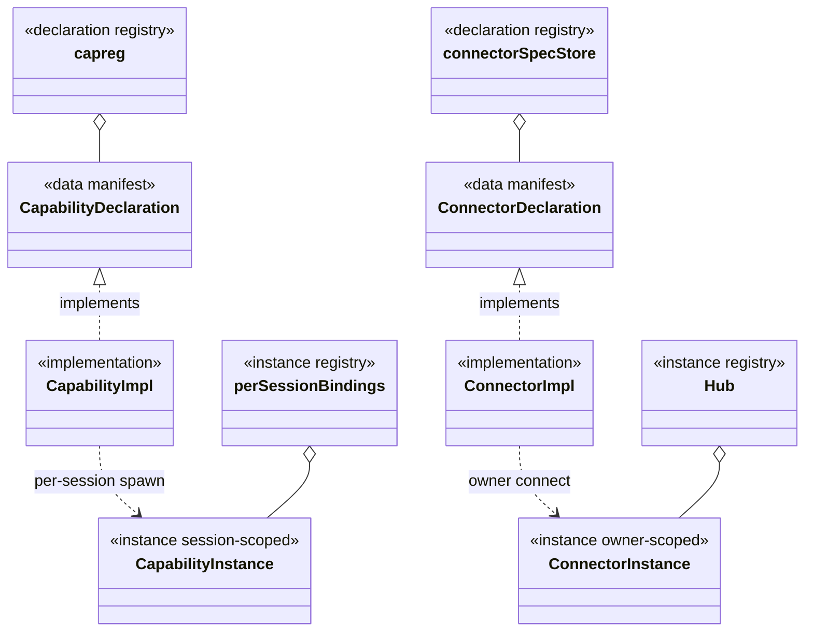
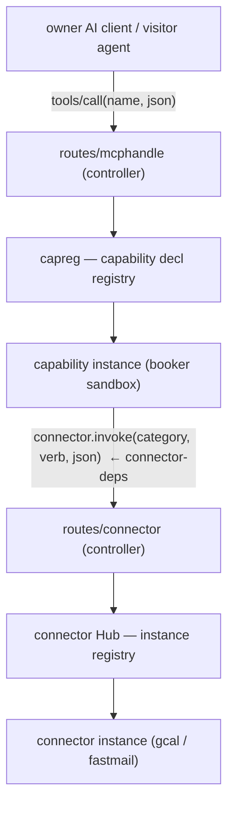

# Backend domain modules — package by domain, dissolve the layer god-packages

**Status:** design (2026-07-25). Supersedes the ad-hoc socket-op placement and the typed
`contract.CalendarProxy` category surface. Companion vault node:
`[[backend-domain-modules]]` under `[[structure]]`.

## The disease — three god-packages sliced by *layer*

The backend is packaged **by layer**, so every domain's pieces are scattered across three
buckets that only grow:

```
internal/usecases  (106 files)  ← every domain's usecase dumped together
internal/domain    ( 55 files)  ← every domain's entity dumped together
internal/postgres  ( 66 files)  ← every domain's repo dumped together
```

Consequences:

- **Reverse dependencies.** `internal/connector/slots.go` imports `internal/usecases`
  (`usecases.AgentToolConnector`, `usecases.ErrMailNotConfigured`) — a domain depending
  *upward* on the god-package for its **own** concepts, because those concepts have no
  home in the connector domain.
- **A capability that wants its own {entity + usecase + repo} must cross all three buckets.**
- **A typed category surface in Go.** `contract.CalendarProxy` (`FreeBusy/InsertEvent/…`) is a
  compile-time interface: adding a category/verb needs a recompile, and it is exactly the
  "typed category handle" that #135 forbids the kernel to hold.

## The principle — package by domain

Each **domain** becomes a self-contained module `internal/<domain>/` that owns its full
vertical — **entity + usecase + repo + a public interface** — and exposes *only* that public
interface to the rest of the system. A domain's own usecases live in the domain, not in a
global bucket. Shared layers are allowed **only** for things that genuinely belong to *no*
domain (see [Shared infra](#shared-infra-truly-domain-less)); the moment "shared" holds a
domain-specific thing it is a god-package again.

## Controllers — the real entry layer

`internal/routes/*` is the real, backend-wide **controller** layer (`server.go` assembles
chi, does zero business). It handles **all** inbound traffic and delegates to domain-module
public interfaces:

| controller | inbound | delegates to |
|---|---|---|
| `routes/admin` · `public` · `sys` · `pubapi` | HTTP | domain usecases |
| `routes/mcphandle` | owner MCP (`/mcp`) | `capreg` (capability axis) |
| `routes/connector` | sandbox↔host socket bridge | `connector.invoke` (connector axis) |

A domain module's "internal controller" is **not** a controller — it is the module's public
facade. Only `routes/*` are controllers.

## The two plugin axes — one meta-structure

Two axes of externally-provided functionality. **They are the same abstraction**, differing
*only* in the call convention:

```
{ declaration (data) → implementation → instance → ONE opaque call door }
```

- **declaration** — a **data** manifest (discovered from disk, or owner-registered). Says what
  a thing *is*: a category and its verbs + schemas, or a capability and its tools + schemas.
  **Never a Go interface.** (This is what OpenAPI connectors already do; only the built-in
  gcal/mail still carry a typed `contract.CalendarProxy` — the un-migrated remnant.)
- **implementation** — the adapter/plugin that satisfies a declaration (an OpenAPI/protocol
  connector adapter; a capability's MCP-server binary).
- **instance** — the runtime, scoped, invoke-able thing. Its **scope differs by axis**:
  connector instance = **owner-persistent** (a connected account + creds); capability instance
  = **session-ephemeral** (a per-session cold-spawned sandbox).
- **one opaque call door** — each axis has exactly one generic entry, keyed by name, opaque
  JSON in/out. No typed surface; the callee never sees the caller.



### Two registries per axis (a declaration registry ≠ an instance registry)

`capreg` is a **declaration** registry (it holds capability types); its true counterpart is the
**connector spec store**, *not* the `Hub`. The `Hub` is the connector **instance** registry;
its counterpart is the per-session capability bindings.

| | declaration registry (types) | instance registry (runtime) |
|---|---|---|
| capability axis | `capreg` — boot plugins + owner-registered MCP / installed skill | per-session cold-spawned sandbox bindings |
| connector axis | connector spec store — boot built-ins + owner-uploaded spec | `Hub` (owner's connected accounts + creds) |

### Owner has both a type path and an instance path — on both axes

Registration is **not** boot-only; the owner extends the type set at runtime, then makes
instances:

| | register a **type** (declaration) | create an **instance** |
|---|---|---|
| connector | `POST /connectors` (`+ /validate-spec`) → `Hub.Upsert` an uploaded OpenAPI spec | `POST /{id}/credentials` + `/connect` + `/activate` |
| capability | `POST /mcp-servers` (external MCP server) · marketplace `InstallSkill` | per-session sandbox spawn (+ enable/disable gate) |

### The two call doors, and where they touch



- **Calling a capability:** `tools/call(toolName, json)` — one door (mcphandle + sandbox dial).
- **Calling a connector:** `connector.invoke(category, verb, json)` — one door
  (`routes/connector` controller → `Slots.Invoke`).
- **The only cross-axis edge is `connector-deps`:** a capability *instance* (booker), at
  runtime, calls the connector door. Capabilities sit above connectors; a capability reaches
  *down* to a connector, never the reverse. The connector never asks `capreg` for anything.

### Why category (not a specific provider name)

StandMeet is **self-hosted**: each owner brings their own calendar/mail (Google, Fastmail,
self-hosted CalDAV/SMTP). The platform cannot pick a provider. So a capability programs against
a **category** (`calendar`) — a swappable interface — and the owner binds a concrete provider as
the active instance. Swap the provider → rebind `(owner, category) → active instance`; the
capability is unchanged. Category also groups the verb contract and keeps credentials on the
connector side. (For a single instance hardcoded to one provider this whole indirection is
unnecessary — it exists *because* the product is BYO-integration.)

## Domain inventory

### Core domain modules (`internal/<domain>/`, each owns entity+usecase+repo+public)

| module | absorbs (from the three god-packages) |
|---|---|
| **corpus** | raw / wiki / output / writing(s) / note / tree_node / citation / subjectivity / crosslink / seo / content — **+ search (Meili) as its retrieval infra** |
| **conversation** | chat / dialog / message / conversation_ghost / visitor-session assembly — **+ inference as its agent engine** |
| **connector** | connection / integration / mail_connector / **connectorsvc (its admin/lifecycle)** + adapters. (Its registry/door move to the platform axes, below.) |
| **access** | access_code / access_request / role / role_snapshot / dock_buttons / path_acl / api_key **(+ session)** |
| **owner** | owner / account / instance / app_state / page_content / custom_page / appearance / keypair / login / password / recovery **+ mail (mail_otp / outbound) + prompts** |
| **security** | captcha / banned_ip / login-guard · anti-replay (auth = access; **protection = security**) |
| **marketplace** | marketplace / skill / mcp_server |
| **stats** (observability) | stats_activity / growth / jobs / inference_usage / system_info |

### Fully externalized capabilities (sandboxed plugins — **not** core domains)

`booker` · `retrieval` · `summarize` · **`report`** · `ask-visitor` · `mail-sender` ·
`ownercore` · `jobs`.

### Shared infra (truly domain-less)

`capsocket` (bare transport) · `pgxpool` (raw pool, ≠ the 66 repos) · `cryptobox` · `httpx` ·
`retry` · `storage` · `gotenberg` · `sandbox`/`sandboxws` · `config` · `apierr`.

### Platform mechanism (the plugin底座, not a domain)

`capreg` (+ the connector declaration/instance registries — the two axes) · `plugins` ·
`paritymanifest` · `facadeparity`.

## What dies

- `internal/usecases` (106) / `internal/domain` (55) / `internal/postgres` (66) as god-packages —
  contents redistributed into the domain modules above.
- `contract.CalendarProxy` and any typed category surface — the declaration becomes **data**.
- `connector → usecases` reverse dependency — `AgentToolConnector` / `ErrMailNotConfigured`
  move back into the connector domain.
- Naming: `capreg` → *capability declaration registry*; `connector.Hub` → *connection (instance)
  registry*; the socket-op handlers move to `internal/routes/<domain>/` (controllers).

## Migration — connector as the pathfinder

1. **Pathfinder (done):** the `connector.invoke` controller moved from `internal/connector` to
   `internal/routes/connector` (thin shell → delegates to `connector.Slots`); go-arch-lint
   component `connectorroutes` (may depend only on `capsocket`); `connector` no longer depends on
   `capsocket`. Green + arch-locked.
2. Genericize the connector declaration to **data** (remove `contract.CalendarProxy` as *the*
   declaration; keep at most a built-in adapter's internal typing).
3. Move connector's own concepts (`AgentToolConnector`, `ErrMailNotConfigured`) out of `usecases`
   into the connector domain; kill the reverse dep.
4. Split the connector registries: **declaration store** (specs) vs **instance registry**
   (`Hub` → connections).
5. Then replicate the module shape for the other domains, dissolving the three god-packages one
   domain at a time; each slice green (build + go-arch-lint + core-agnostic ratchet) before the
   next.

Each move is one commit, verified before the next — never a big-bang.

## Open / to confirm

- Final names for the two registries per axis ("declaration/type store" vs "instance store").
- Exact contents of the `security` module boundary vs `access` (auth stays in access;
  protection in security).
