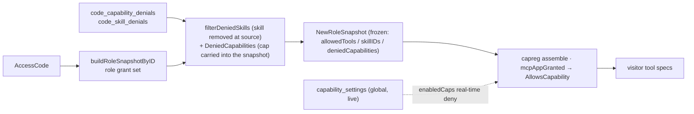

# Capability visibility — global / role / code three-layer ACL (pure AND narrowing)

> **Status:** Design finalized (drafted 2026-06-20, decisions settled 2026-06-23). The concrete landing of the "permissions (ACL) cross-cutting controller" in [`platform-architecture.md`](platform-architecture.md).
> **Scope:** Extend "which capabilities / corpus / skills a visitor can actually see" from today's **single-layer per-role freeze** into **global → role → code three-layer pure AND narrowing**.
> **Prerequisite:** Phase H (`capability_settings` global switch + capability panel) has landed; it is the **global layer** of this design. The reader is assumed to have read `CLAUDE.md` and the RoleSnapshot freezing scheme.
> **Decisions settled (2026-06-23):** A.1 accept · A.2 accept (v1 does capability + skill only; corpus glob deferred) · A.3 accept · **A.4 changed: pure AND, code can only deny, tri-state override cut**. The three layers are pure intersection narrowing; no layer can open up something an upper layer did not give — the `override`/tri-state concept is deleted entirely, see §3.

---

## TL;DR

Whether a visitor can see capability X is decided by **three gates, pure AND**; each layer can only **narrow** (no layer can open up something an upper layer did not give):

```
exposed(X) = global_enabled(X)         ← live ban gate (owner can switch it off any time; running sessions lose it immediately)
           ∧ role_grants(X)            ← frozen at issue: the role's grant baseline
           ∧ NOT code_denies(X)        ← frozen at issue: the code cuts further from the role (subtract only)
           ∧ connector_deps_met ∧ quota ← already exists
```

- **global** = live (Phase H's `capability_settings`). Not frozen; read in real time at assemble. **Pure ban**: off means nobody has it; on takes no position and defers to the layers below.
- **role** = the grant baseline frozen into `RoleSnapshot` at issue (current behavior).
- **code** = **new**: a **pure deny** (`-toolY`) by the code on top of its role, subtracted from the role's grants at issue and then frozen into RoleSnapshot. **A code cannot allow** — it can neither flip a role's deny nor add a capability the role does not have.

The whole scheme is **pure intersection narrowing**: `role grants ∧ code did not cut ∧ global did not switch off`. No tri-state, no override, no "who overrides whom" — every layer can only make capabilities **fewer**. To give a code one more capability = switch it to a role that grants that capability (the code picks its role through `AssumedRoleID`), not a reverse allow on the code.

---

## 1. Why the three layers have asymmetric semantics (freeze vs live)

This is the **core tension** of the design and must be explained first, or it will break existing invariants.

| Layer | Frozen/live | Reason |
|---|---|---|
| **global** | **Live** | When the owner switches something off in the capability panel, **running sessions must lose it immediately too** (`block-disable-while-attached` locks exactly this). Freezing would lose that semantics. |
| **role** | **Frozen at issue** | Existing core invariant: the owner editing a role / prompt / skill **does not affect running sessions**, only later new issues; the only remedy = revoke the code. Only freezing gives this property. |
| **code** | **Frozen at issue** | Same as role: the code's deny is also stamped into RoleSnapshot at issue (already subtracted); it is not re-read during the session lifetime. |

So all three layers are AND terms, but **frozen/live is asymmetric**:

- **role ∧ ¬code_deny** is a **frozen** pair of narrowings (the code subtracts from the role), computed at issue and frozen into the snapshot.
- **global** is a **live ban gate** stacked on top of them (pure deny, takes effect any time).

> **A.1 (accept)** — Accept the mixed semantics: global live, role/code frozen. global is a pure ban AND term (off → nobody has it, on → defer to the layers below), not a source of grants.

---

## 2. Which targets the ACL covers

The ACL in the existing RoleSnapshot has four kinds; all three layers act on them with the same narrowing semantics (global ban / role grant / code deny):

| Target kind | Current storage | Code narrowing semantics |
|---|---|---|
| **Capability / tool grant** | `role.allowed_tools text[]` | Code per-ID **deny** (subtract from what the role grants) |
| **Corpus admission** | `role_corpus_uris` (path-glob, first-match-wins) | Deferred (order-sensitive glob narrowing is scheduled separately) |
| **Skill grant** | `role_skills` | Code per-ID **deny** |
| **Owner MCP server** | `role_mcp_servers` | Deferred |

> **A.2 (accept)** — The first version does **only the capability/tool + skill kinds** (discrete IDs, clean deny sets); hierarchical narrowing of corpus globs (order-sensitive, first-match-wins) gets its own sub-phase.

---

## 3. Resolution algebra (pure AND · narrowing)

No tri-state. Every layer can only make capabilities **fewer**. Exhaustive truth table (per target):

| baseGrant | code deny | frozen |
|---|---|---|
| Y | — | **allow** (inherited) |
| Y | Y | **deny** (code revokes) |
| N | — | **deny** (not granted) |
| N | Y | deny (idempotent noop) |

`default = deny`. A code **can only deny**; the two `baseGrant=N` rows are always deny — a code cannot produce what was not given.

**Key implementation detail (the shape forced by ACL=always):** capabilities have an `ACL=always` tier (retrieval /
ask_visitor / summarize and other built-in base capabilities, **always exposed regardless of role grants**). They never enter
`allowedTools`, so **they cannot be denied by "subtracting from allowedTools"**. Therefore:

- **capability**: the deny is frozen separately into `RoleSnapshot.deniedCapabilities` and **blocked at the exposure gate**. The gate
  = `RoleSnapshot.AllowsCapability(capID, aclAlways)` = `baseGrant(aclAlways ∨ allowedTools∋capID)
  ∧ capID ∉ deniedCapabilities`. This is the **truth anchor** of the whole frozen decision (domain unit tests §A lock it),
  and `mcpAppGranted` delegates to it directly. `baseGrant` is still pure role state (allowedTools untouched); the deny is a separate term stacked on
  the gate — it can block even always capabilities.
- **skill**: no always tier. The deny is removed **at the assembly source** (`filterDeniedSkills` filters by id),
  so the skill's L1 prompt / tool grant / skill id **all** disappear together (subtracting only skillIDs would leak the L1 prompt).

Computed at issue and frozen into `RoleSnapshot`: `deniedCapabilities` is a new field; `skillIDs/skillPrompts/
allowedTools` are the source-filtered results. Downstream reads stay the same, except `mcpAppGranted` now delegates to `AllowsCapability` (adding one
deny check).

**Live layer (global)** — at assemble time (every visitor message):

```
exposed(cap) = frozenAllows(cap)                  # AllowsCapability (includes code deny)
             ∧ NOT global_disabled(owner, cap)    # not switched off in capability_settings
```

global can only **switch off** — a ban gate, not a source of grants.

> **A.3 (accept)** — global only subtracts, never adds (pure deny master). "Switched off in the capability panel" = forced offline; the panel cannot open **more** for a visitor than their role has.

---

## 4. Data model

**global layer (exists, Phase H):**
```sql
capability_settings(owner_id, capability_id, enabled, …)   -- enabled=false ⇒ global deny
```

**code deny layer (new):** a code can only **subtract** from the role, so it is a pure deny set with **no state column** (row present = deny, no row = inherit):
```sql
-- the code cuts a capability the role grants (no row = inherit the role)
code_capability_denials(
    code_id       uuid REFERENCES access_codes(id) ON DELETE CASCADE,
    capability_id text,
    PRIMARY KEY (code_id, capability_id)
)
-- skill has the same shape: code_skill_denials(code_id, skill_id)
```
(The role layer stays as it is: `allowed_tools` / `role_skills`…. It is still "the set the role says allow"; absent means the role does not grant it.)

> **A.4 (changed → pure AND · deny-only)** — Cut the original tri-state `code_capability_overrides(state allow/deny)` and replace it with the pure deny table `code_capability_denials` (presence = deny). A code can only narrow, never reverse-allow. Sparse (only the cut ones are stored); the code editor shows "what was subtracted relative to the role". **No allow rows = no "code resurrection/privilege escalation" corners** (the §6 tests slim down accordingly).

---

## 5. Code architecture — change / keep / delete

> Principle: the new design carries no old leftovers. Below, each area is marked **KEEP / CHANGE / ADD / DELETE**, each pointing at real files. **This area does not compromise with or patch around the existing structure** — what must change is changed cleanly, but one iron invariant is respected: **role/code are frozen into RoleSnapshot at issue and not re-read during the session lifetime**.

### 5.1 Merge point (the single core change)

When issuing a code-tier session, `buildRoleSnapshotForCode(code)` today passes `code.AssumedRoleID` straight to `buildRoleSnapshotByID`. The code deny is inserted between "assembling the role grant set" and "`NewRoleSnapshot` freezing":



### 5.2 Change / keep / delete list (as built)

| Area | File | Action | Notes |
|---|---|---|---|
| **Merge point** | `internal/usecases/visitor_role_snapshot.go` | **CHANGE** | `buildRoleSnapshotForCode` reads `deps.CodeDenials.List(code.ID)` and passes `denials` into `buildRoleSnapshotByID`: skills are removed at the source through `filterDeniedSkills` (prompt/tool/id all disappear together), and the cap deny set goes into `DeniedCapabilities`. owner-vanilla (public/byoai) passes zero denies and keeps current behavior. |
| **Truth anchor** | `internal/domain/role_snapshot.go` | **CHANGE** | RoleSnapshot gains a `deniedCapabilities` field (including wire round-trip) + `AllowsCapability(capID, aclAlways) bool` = `baseGrant ∧ ¬denied`. The §A domain unit tests lock it. |
| **Capability exposure gate** | `internal/usecases/capreg_mcp_app.go` `mcpAppGranted` | **CHANGE** | Delegates to `snap.AllowsCapability(m.ID, m.ACL==always)` — so ACL=always capabilities can also be blocked by a code deny (subtracting cannot remove them). |
| **Deny read/write** | `internal/postgres/code_denials.go` (new) + `db/queries/code_denials.sql` | **ADD** | `CodeDenialRepo`: List/Add/Delete capability & skill. Read once at issue to feed the merge; written by admin sub-routes. |
| **schema** | `db/schema.sql` | **ADD** | Two sparse tables `code_capability_denials` / `code_skill_denials` (§4, no state column). Pure table addition; `roles`/`access_codes` untouched. |
| **port** | `usecases.CodeDenialReader` + `VisitorSessionDeps.CodeDenials` | **ADD** | Narrow read interface (List capability/skill); nil = zero denies (eval facade / old paths stay backward compatible). |
| **Other downstream gates** | `enabledCaps` / skill runner / `AllowedTools()` / `SkillIDs()` | **KEEP** | Skills are already filtered at the source; cap denies all converge in `AllowsCapability`. These reads are unchanged. |
| **global layer** | `capability_settings` + `enabledCaps` live gate | **KEEP** | Done in Phase H; orthogonal. |
| **admin: code editing** | `internal/routes/admin/codes_denials.go` (new) + `MountCodes` | **ADD** | 5 sub-routes: GET denials, POST/DELETE capability-denials, POST/DELETE skill-denials. owner-scope (GetByID compares owner → 404). |
| **admin: role editing / capability panel** | role routes / `capabilities.go` | **KEEP** | Untouched. |

### 5.3 No old leftovers — points to check for deletion

The new design requires "delete what should be deleted; don't let old and new coexist and create two sources of truth". Reviewing it, this phase **has no old code to delete** (this is a purely incremental extension, not a replacement), but two places **must be explicitly checked to prevent decay into two sources**:

- **`code.AssumedRoleID` is kept** — a code still uses it to pick its role; the deny is stacked on the chosen role and **subtracts further**; it does not replace picking the role. **This is by design**, not a leftover. To give a code one more capability = switch to a role that grants that capability.
- **Do not also stuff the deny into `RoleSnapshot` as a fourth field kind** — once the snapshot holds both "the allow list after subtraction" and "the raw deny set", there are two sources and they will drift. The deny **lives only in the merge function at the moment of issue**, is thrown away after subtraction, and the snapshot keeps only the result. (Corresponds to "the snapshot does not change shape" in §2.)
- **A skill's enable is still `domain.Skill.Enabled` (clarified in Phase H)** — a code deny controls the skill's **grant narrowing** (whether this code cuts it), not the skill's **existence/availability** (the owner's global `skill.Enabled`). The two are orthogonal. A code can only subtract and never "resurrects" a globally disabled skill, so corners like the original `acl-code-allow-cannot-resurrect-disabled-skill` no longer exist.

---

## 6. Migration + tests (red first, same rhythm as the other phases)

**Migration:** pure table addition (`code_capability_denials` / `code_skill_denials`), existing role columns untouched → old codes naturally have "zero denies = fully inherit the role"; behavior unchanged (backward compatible, no data migration).

**The test design has its own document:** [`block-acl-hierarchy-tests.md`](block-acl-hierarchy-tests.md) — exhaustive truth table (6 rows) + happy combination matrix (capability/skill target kinds) + both frozen/live timings + per-code isolation + error stream + corners (crossings of three orthogonal gates) + regression anchors + red-first order. Not repeated in this section.

---

## 7. Relation to Phase H + the global layer landed this round

The **global layer of this design = what Phase H already delivered**, plus three fixes found in this deep dive (all about global-layer correctness):
- External MCP plugins discovered at install are registered with the **managed** origin (previously mistakenly builtin).
- The capability panel lists only capabilities **with a visitor surface** (owner-only seo/writings… get no no-op switch).
- The skill row switch is wired to the **real `skill.Enabled`** (which the skill runner actually reads), not capability_settings.

The role/code layers (the body of this document) are a later, separate phase.

---

## Decision summary (settled 2026-06-23)

- **A.1 accept** — mixed semantics of global live / role·code frozen; global is a pure ban AND term.
- **A.2 accept** — the first version does only capability + skill; corpus glob hierarchy is scheduled separately.
- **A.3 accept** — global is a pure deny master (only subtracts, never adds).
- **A.4 changed** — **pure AND, code can only deny**: cut the tri-state override and use the sparse deny tables `code_capability_denials` / `code_skill_denials` (presence=deny, no state column). The whole scheme is the pure intersection narrowing `role grants ∧ code did not cut ∧ global did not switch off`, with no "reverse allow / override" of any kind.
