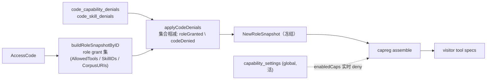

# 能力可见性 —— global / role / code 三层 ACL（纯 AND 收窄）

> **状态：** 设计定稿（2026-06-20 起草，2026-06-23 决策落定）。是 [`platform-architecture.md`](platform-architecture.md) 里"权限（ACL）横切 controller"的细化落地。
> **范围：** 把"一个访客到底能看到哪些能力 / corpus / skill"从现在的**单层 per-role 冻结**，扩成 **global → role → code 三层纯 AND 收窄**。
> **前置：** Phase H（`capability_settings` 全局开关 + 能力面板）已落地，它就是本设计的 **global 层**。读者默认读过 `CLAUDE.md` 和 RoleSnapshot 冻结那套。
> **决策落定（2026-06-23）：** A.1 accept · A.2 accept（v1 只做 capability + skill，corpus glob 延后）· A.3 accept · **A.4 改：纯 AND、code 只能 deny，砍掉 tri-state override**。三层是纯交集收窄，没有任何一层能凭空放开上层没给的——`override`/tri-state 概念全删，见 §3。

---

## TL;DR

一个访客能不能看到能力 X，按**三层闸纯 AND**判定，每层只能**收窄**（没有任何一层能放开上层没给的）：

```
exposed(X) = global_enabled(X)         ← 活的 ban 闸（owner 随时关，在跑 session 立刻失效）
           ∧ role_grants(X)            ← issue 时冻结：role 的授权基线
           ∧ NOT code_denies(X)        ← issue 时冻结：code 从 role 里再砍（只能减）
           ∧ connector_deps_met ∧ quota ← 已有
```

- **global** = 活的（Phase H 的 `capability_settings`）。不冻结，assemble 时实时读。**纯 ban**：关了大家都没，开了不表态、交给下面。
- **role** = issue 时冻结进 `RoleSnapshot` 的授权基线（现状）。
- **code** = **新增**：code 在自己 role 之上的**纯 deny**（`-toolY`），issue 时从 role 的授权里减掉，再冻进 RoleSnapshot。**code 不能 allow** —— 翻不了 role 的 deny、也加不了 role 没有的能力。

整套是**纯交集收窄**：`role 授 ∧ code 没砍 ∧ global 没关`。没有 tri-state、没有 override、没有"谁覆盖谁"——每层只会让能力**更少**。要给某 code 多一个能力 = 给它换一个授了那能力的 role（code 选 role 经 `AssumedRoleID`），不是 code 反向 allow。

---

## 1. 为什么三层语义不对称（freeze vs live）

这是本设计的**核心张力**，必须先讲清，否则会撞坏现有不变量。

| 层 | 冻结/活 | 理由 |
|---|---|---|
| **global** | **活** | owner 在能力面板一关，**在跑的 session 也要立刻消失**（`capability-disable-while-attached` 锁的就是这个）。冻结就没了这语义。 |
| **role** | **issue 时冻结** | 现有核心不变量：owner 编辑 role / prompt / skill **不影响在跑 session**，只影响后续新 issue；唯一补救 = revoke code。冻结才有这性质。 |
| **code** | **issue 时冻结** | 同 role：code 的 deny 也在 issue 时拍进 RoleSnapshot（已减好），session 生命周期不回读。 |

所以三层都是 AND 项，但**冻结/活不对称**：

- **role ∧ ¬code_deny** 是一对**冻结**的收窄（code 从 role 里减），issue 时算好冻进快照。
- **global** 是叠在它们之上的**活 ban 闸**（纯 deny，随时生效）。

> **A.1（accept）** —— 接受混合语义：global 活、role/code 冻结。global 是纯 ban AND 项（关→全没，开→交给下面），不是授权来源。

---

## 2. ACL 覆盖哪些 target

现有 RoleSnapshot 里的 ACL 是四类，三层都按同一套收窄语义（global ban / role 授 / code deny）作用于它们：

| target 类 | 当前存储 | code 收窄语义 |
|---|---|---|
| **capability / tool 授权** | `role.allowed_tools text[]` | code per-ID **deny**（从 role 授的里减） |
| **corpus 准入** | `role_corpus_uris`（path-glob，first-match-wins） | 延后（顺序敏感 glob 收窄单独排） |
| **skill 授权** | `role_skills` | code per-ID **deny** |
| **owner MCP server** | `role_mcp_servers` | 延后 |

> **A.2（accept）** —— 第一版**只做 capability/tool + skill 两类**（离散 ID，deny 集干净），corpus glob 的层级收窄（顺序敏感、first-match-wins）单独排一个子阶段。

---

## 3. resolution 代数（纯 AND · 收窄 / 集合相减）

没有 tri-state。每层只会让能力**更少**。

**冻结层（role ∧ ¬code_deny）解析** —— 给定访客的 code → 它的 role：

```
frozenAllow(T 类) = roleGranted(role, T) \ codeDenied(code, T)
```

即 role 授的集合，减掉 code 显式 deny 的。穷尽真值（per target ID）：

| role 授 | code deny | frozen |
|---|---|---|
| Y | — | **allow**（继承 role） |
| Y | Y | **deny**（code 撤销 role 授的） |
| N | — | **deny**（继承 role 未授） |
| N | Y | deny（幂等 noop —— deny 一个 role 本就没授的，无效果） |

`default = deny`（positive-list；要 role 显式 grant 才有）。code **只能 deny**，所以 `role=N` 那两行恒 deny —— code 永远翻不出 role 没给的。

issue 时对每个 target 跑一遍 `\`，把结果冻进 `RoleSnapshot.allowedTools / skillIDs`。**RoleSnapshot 形状不变** —— 还是一份 allow 列表，只是这份列表是 **role 减掉 code-deny 后的结果**。下游 gate / skill runner 读法完全不变。

**活层（global）** —— assemble 时（每条访客消息）：

```
exposed(cap) = cap ∈ frozenAllow                  # 冻结快照里有
             ∧ NOT global_disabled(owner, cap)    # capability_settings 里没被关
```

global 只能**关**，不能凭空开一个 role 没授权的能力 —— ban 闸，不是授权来源。

> **A.3（accept）** —— global 只减不增（纯 deny master）。"能力面板关掉" = 强制下线；面板不能给某访客**多**开一个他 role 没有的能力。

---

## 4. 数据模型

**global 层（已存在，Phase H）：**
```sql
capability_settings(owner_id, capability_id, enabled, …)   -- enabled=false ⇒ global deny
```

**code deny 层（新增）：** code 只能从 role 里**减**，所以是纯 deny 集，**没有 state 列**（有行 = deny，无行 = 继承）：
```sql
-- code 砍掉 role 授的某能力（不写 = 继承 role）
code_capability_denials(
    code_id       uuid REFERENCES access_codes(id) ON DELETE CASCADE,
    capability_id text,
    PRIMARY KEY (code_id, capability_id)
)
-- skill 同形态：code_skill_denials(code_id, skill_id)
```
（role 层维持现状：`allowed_tools` / `role_skills`…。它仍是"role 说 allow 的集合"；缺省即该 role 不授。）

> **A.4（changed → 纯 AND · deny-only）** —— 砍掉原 tri-state `code_capability_overrides(state allow/deny)`，改成纯 deny 表 `code_capability_denials`（presence = deny）。code 只能收窄、不能反向 allow。稀疏（只存砍掉的），code 编辑器显示"相对 role 减掉了哪些"。**没有 allow 行 = 没有"code 复活/越权"这类 corner**（§6 测试相应瘦身）。

---

## 5. 代码架构 —— 改 / 留 / 删

> 原则：新设计不背老残留。下面逐块定 **KEEP（不动）/ CHANGE（改）/ ADD（新增）/ DELETE（删）**，每条点到真实文件。**这块不跟现有结构妥协拼凑** —— 该改的改干净，但要尊重一个铁律不变量：**role/code 在 issue 时冻结进 RoleSnapshot，session 生命周期不回读**。

### 5.1 合并点（唯一改动核心）

issue code-tier session 时，`buildRoleSnapshotForCode(code)` 现在直接把 `code.AssumedRoleID` 丢给 `buildRoleSnapshotByID`。code-deny 就插在"拼好 role grant 集"与"`NewRoleSnapshot` 冻结"之间：



### 5.2 改 / 留 / 删 清单

| 区块 | 文件 | 动作 | 说明 |
|---|---|---|---|
| **合并函数** | `internal/usecases/visitor_role_snapshot.go` | **CHANGE** | `buildRoleSnapshotForCode` 在拼好 role 的 `AllowedTools`/`SkillIDs` 之后、`NewRoleSnapshot` 之前，调新增的纯函数 `applyCodeDenials(roleTools, roleSkillIDs, deniedCaps, deniedSkills)`（集合相减）。owner-vanilla（public/byoai）路径**不**走 deny 层（没有 code），保持现状。 |
| **deny 解析** | `internal/domain/code_denial.go`（新） | **ADD** | 纯 domain 函数 `ResolveACL(roleGranted []string, denied []string) []string`：`roleGranted \ denied`（去掉被 deny 的）。无 IO、可单测。§3 真值表落这里，是整套唯一的"真值之锚"。 |
| **deny 读取** | `internal/postgres/code_denial.go`（新）+ `db/queries/code_denials.sql` | **ADD** | `ListCodeCapabilityDenials(codeID)` / `ListCodeSkillDenials(codeID)`。issue 时一次性读，喂给合并函数。 |
| **schema** | `db/schema.sql` | **ADD** | `code_capability_denials` / `code_skill_denials` 两张稀疏表（§4，无 state 列）。**纯加表**，不动 `roles` / `access_codes` 现有列。 |
| **RoleSnapshot 本身** | `internal/domain/role_snapshot.go` | **KEEP** | 形状不变 —— 还是冻结后的 allow 列表。相减在它**之前**发生，它不知道有 code-deny 这回事。**这是关键：下游零改动。** |
| **下游 gate** | `capreg` `enabledCaps` / booker `bookerSkillGranted` / `mcpAppGranted` / skill runner | **KEEP** | 全部继续读 `RoleSnapshot.AllowedTools()` / `SkillIDs()`。它们看到的就是"role ⊕ code 合并后的结果"，分不出也不需要分出是 role 给的还是 code 给的。 |
| **global 层** | `capability_settings` + `enabledCaps` 活 gate | **KEEP** | Phase H 已做。它是叠在冻结快照之上的活 master，跟本期合并逻辑正交。 |
| **admin: code 编辑** | `internal/routes/admin/codes.go` + 新 deny 子路由 | **ADD** | code 上加"能力 deny"读写（相对 role 的稀疏 −，纯删）。 |
| **admin: role 编辑** | role 路由 | **KEEP** | role ACL 仍是现状的 grant 列表，不动。 |
| **能力面板（global）** | `capabilities.go` + 前端面板 | **KEEP** | 本期不碰。 |

### 5.3 不留老残留 —— 要核对删的点

新设计要求"该删的删，别让老的和新的并存制造两套真值来源"。盘下来本期**没有要删的旧代码**（这是纯增量扩展，不是替换），但有两处**必须显式核对、防止退化成双源**：

- **`code.AssumedRoleID` 保留** —— code 仍靠它选 role；deny 是叠在所选 role 之上**再减**，不是取代选 role。**设计如此**，不算残留。要给 code 多一个能力 = 换一个授了那能力的 role。
- **不要把 deny 也塞进 `RoleSnapshot` 当第四类字段** —— 一旦 snapshot 里既有"减完的 allow 列表"又有"原始 deny 集"，就是双源、必然漂移。deny **只活在 issue 那一刻的合并函数里**，减完即抛，snapshot 只留结果。（对应 §2 的"snapshot 不变形"。）
- **skill 的 enable 仍是 `domain.Skill.Enabled`（Phase H 已厘清）** —— code deny 控的是 skill 的**授权收窄**（这个 code 砍不砍），不是 skill 的**存在/可用**（owner 全局 `skill.Enabled`）。两者正交。code 只能减，不会"复活"被全局禁的 skill，所以原 `acl-code-allow-cannot-resurrect-disabled-skill` 这类 corner 不复存在。

---

## 6. 迁移 + 测试（红先行，跟其他 phase 同节奏）

**迁移：** 纯加表（`code_capability_denials` / `code_skill_denials`），不动 role 现有列 → 老 code 自然"零 deny = 完全继承 role"，行为不变（向后兼容，无数据迁移）。

**测试设计单开一份：** [`capability-acl-hierarchy-tests.md`](capability-acl-hierarchy-tests.md) —— 穷尽真值表（6 行）+ happy 组合矩阵（capability/skill 两类 target）+ 冻结/活两种时序 + per-code 隔离 + 错误流 + corner（三道正交闸交叉）+ 回归锚 + 红先行顺序。本节不再重复。

---

## 7. 与 Phase H 的关系 + 本轮已落地的 global 层

本设计的 **global 层 = Phase H 已交付的东西**，外加这次深挖补的三处修正（都属 global 层正确性）：
- 装机发现的外部 MCP 插件注册成 **managed** origin（之前误成 builtin）。
- 能力面板只列**有访客面**的能力（owner-only 的 seo/writings… 不放 no-op 开关）。
- skill 行开关接**真 `skill.Enabled`**（skill runner 真读的），不是 capability_settings。

role/code 两层（本文档主体）是后续独立 phase。

---

## 决策点汇总（2026-06-23 落定）

- **A.1 accept** —— global 活 / role·code 冻结的混合语义；global 是纯 ban AND 项。
- **A.2 accept** —— 第一版只做 capability + skill，corpus glob 层级单独排期。
- **A.3 accept** —— global 是纯 deny master（只减不增）。
- **A.4 changed** —— **纯 AND、code 只能 deny**：砍掉 tri-state override，改稀疏 deny 表 `code_capability_denials` / `code_skill_denials`（presence=deny，无 state 列）。整套是 `role 授 ∧ code 没砍 ∧ global 没关` 的纯交集收窄，没有任何"反向 allow / 覆盖"。
