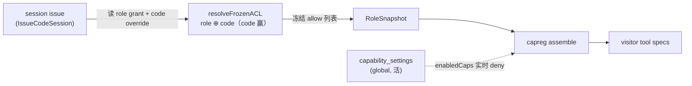

# 能力可见性 —— global / role / code 三层 ACL（继承 + 覆盖）

> **状态：** 设计中（2026-06-20 起草）。是 [`platform-architecture.md`](platform-architecture.md) 里"权限（ACL）横切 controller"的细化落地。
> **范围：** 把"一个访客到底能看到哪些能力 / corpus / skill"从现在的**单层 per-role 冻结**，扩成 **global → role → code 三层继承 + 覆盖**。
> **前置：** Phase H（`capability_settings` 全局开关 + 能力面板）已落地，它就是本设计的 **global 层**。读者默认读过 `CLAUDE.md` 和 RoleSnapshot 冻结那套。
> **怎么反馈：** 每块结尾编号决策点（`A.1`、`A.2`…）。回 `Aₙ: accept` / `Aₙ: change — <理由>`，没提到的视作 accept。

---

## TL;DR

一个访客能不能看到能力 X，按**三层闸**判定，越具体越能收窄、也能反向放开：

```
exposed(X) = global_live(X)            ← 活的 master kill-switch（owner 随时关，在跑 session 立刻失效）
           ∧ frozen_acl(role ⊕ code, X) ← issue 时冻结：role 基线，code 覆盖 role
           ∧ connector_deps_met ∧ quota  ← 已有
```

- **global** = 活的（Phase H 的 `capability_settings`）。不冻结，assemble 时实时读。
- **role** = issue 时冻结进 `RoleSnapshot` 的基线 ACL（现状）。
- **code** = **新增**：code 在自己 role 之上的 override（`+toolX` / `-toolY` / 改 corpus glob），issue 时跟 role 合并、code 赢，再冻进 RoleSnapshot。

"继承 + 覆盖"落在 **role ↔ code** 这一对：code 默认继承 role；code 显式 allow 能翻 role 的 deny，反之亦然。global 是叠在最上面的活 master，不参与冻结。

---

## 1. 为什么三层语义不对称（freeze vs live）

这是本设计的**核心张力**，必须先讲清，否则会撞坏现有不变量。

| 层 | 冻结/活 | 理由 |
|---|---|---|
| **global** | **活** | owner 在能力面板一关，**在跑的 session 也要立刻消失**（`capability-disable-while-attached` 锁的就是这个）。冻结就没了这语义。 |
| **role** | **issue 时冻结** | 现有核心不变量：owner 编辑 role / prompt / skill **不影响在跑 session**，只影响后续新 issue；唯一补救 = revoke code。冻结才有这性质。 |
| **code** | **issue 时冻结** | 同 role：code 的 override 也在 issue 时拍进 RoleSnapshot，session 生命周期不回读。 |

所以三层**不是**对称的"每层都是冻结基线、上层被下层继承"。准确说：

- **role ↔ code** 是一对**冻结的继承+覆盖**（code 继承并覆盖 role）。
- **global** 是叠在它们之上的**活 master kill-switch**（top-priority deny，随时生效）。

> **A.1** —— 接受这个混合语义（global 活、role/code 冻结）吗？
> 备选：global 也做成"冻结的默认基线、被 role 继承"，那 kill-switch 得另起一个独立的活层（等于四个概念）。本设计选混合，少一个概念、且不破现有冻结不变量。

---

## 2. ACL 覆盖哪些 target

现有 RoleSnapshot 里的 ACL 是四类，三层都按同一套覆盖语义作用于它们：

| target 类 | 当前存储 | 覆盖语义 |
|---|---|---|
| **capability / tool 授权** | `role.allowed_tools text[]` | tri-state per capability ID |
| **corpus 准入** | `role_corpus_uris`（path-glob，first-match-wins） | tri-state per glob 规则，规则按 specificity 排序 |
| **skill 授权** | `role_skills` | tri-state per skill ID |
| **owner MCP server** | `role_mcp_servers` | tri-state per server ID |

> **A.2** —— 第一版**只做 capability/tool + skill 两类**（离散 ID，tri-state 干净），corpus glob 的层级合并（顺序敏感、first-match-wins）单独排一个子阶段。同意分批吗？

---

## 3. resolution 代数（tri-state · 继承 + 覆盖）

每个 (scope, target) 存一个 **tri-state**：`unset(继承) | allow | deny`。

**冻结层（role ⊕ code）解析** —— 给定访客的 code → 它的 role：

```
for target T:
  s_code = setting(code, T)            # unset | allow | deny
  s_role = setting(role, T)
  effective_frozen(T) =
      s_code != unset ? s_code         # code 显式 → code 赢（覆盖 role）
    : s_role != unset ? s_role         # 否则看 role
    : default(T)                       # 都没说 → 默认
default(capability) = deny  (positive-list；要显式 grant 才有)
default(skill)      = deny
```

issue 时对每个 target 跑一遍，把 `effective_frozen == allow` 的集合冻进 `RoleSnapshot.allowedTools / skillIDs`。**RoleSnapshot 的形状不变** —— 还是一份 allow 列表，只是这份列表是 global-default? 不，是 **role ⊕ code 合并的结果**。下游 gate / skill runner 读法完全不变。

**活层（global）** —— assemble 时（每条访客消息）：

```
exposed(cap) = effective_frozen(cap) == allow     # 冻结快照里有
             ∧ NOT global_disabled(owner, cap)    # capability_settings 里没被关
```

global 只能**关**（deny），不能凭空开一个 role/code 没授权的能力 —— kill-switch 语义，不是授权来源。

> **A.3** —— global 只减不增（纯 deny master），对吗？（即"能力面板关掉" = 强制下线，但面板不能给某访客**多**开一个他 role 没有的能力 —— 那是 role/code 的活。）

---

## 4. 数据模型

**global 层（已存在，Phase H）：**
```sql
capability_settings(owner_id, capability_id, enabled, …)   -- enabled=false ⇒ global deny
```

**code override 层（新增）：** 把 role 的 grant 表"镜像"到 code，但用 tri-state（带 deny）：
```sql
-- code 对 capability 的 override（不写 = 继承 role）
code_capability_overrides(
    code_id      uuid REFERENCES access_codes(id) ON DELETE CASCADE,
    capability_id text,
    state        text NOT NULL CHECK (state IN ('allow','deny')),  -- unset = 没这行
    PRIMARY KEY (code_id, capability_id)
)
-- skill 同形态：code_skill_overrides(code_id, skill_id, state)
```
（role 层维持现状：`allowed_tools` / `role_skills`…。它仍是"role 说 allow 的集合"；缺省即该 role 不授。）

> **A.4** —— code override 用**独立 override 表**（只存跟 role 不同的部分，稀疏），不是把 role 的全套 ACL 拷一份到 code。同意吗？（稀疏 = code 编辑器只显示"相对 role 的增删"，UI 也更说人话。）

---

## 5. 落点（哪段代码改）



- **新增 `resolveFrozenACL(role, codeOverrides)`**（usecases / domain）：合并 → allow 列表。在 `IssueCodeSession` 构造 RoleSnapshot 那一步调。
- **RoleSnapshot 不变形** —— 它继续只持冻结后的 allow 列表；合并发生在它**之前**。下游（skill runner / booker gating / capreg）零改动。
- **global 层不动** —— `capability_settings` + `enabledCaps` 活 gate 保持现状（Phase H 已做）。
- **admin surface**：code 编辑器加"能力 override"区（相对 role 的 +/−）；能力面板（global）维持现状；role 编辑器维持现状。

---

## 6. 迁移 + 测试（红先行，跟其他 phase 同节奏）

**迁移：** 纯加表（`code_capability_overrides` / `code_skill_overrides`），不动 role 现有列 → 老 code 自然"零 override = 完全继承 role"，行为不变（向后兼容，无数据迁移）。

**测试矩阵（全红 → 实现 → 绿）：**
1. `acl-code-inherits-role` —— code 无 override → ACL 完全等于 role（回归保护）。
2. `acl-code-deny-overrides-role` —— role 授了 calendar.book，code deny → 该 code 访客看不到，**同 role 别的 code 仍看得到**。
3. `acl-code-allow-overrides-role` —— role 没授 skillX，code allow → 该 code 访客有（覆盖反向也成立）。
4. `acl-global-beats-all` —— global 关掉 → 不管 role/code 怎么 allow 都没（master 优先；已有 `capability-disable-while-attached` 的强化版）。
5. `acl-frozen-at-issue` —— issue 后改 code override → 在跑 session 不变（冻结不变量）；新 issue 才生效。
6. `acl-resolution-order` —— code > role > default，三态在一个 target 上交叉验证。

---

## 7. 与 Phase H 的关系 + 本轮已落地的 global 层

本设计的 **global 层 = Phase H 已交付的东西**，外加这次深挖补的三处修正（都属 global 层正确性）：
- 装机发现的外部 MCP 插件注册成 **managed** origin（之前误成 builtin）。
- 能力面板只列**有访客面**的能力（owner-only 的 seo/writings… 不放 no-op 开关）。
- skill 行开关接**真 `skill.Enabled`**（skill runner 真读的），不是 capability_settings。

role/code 两层（本文档主体）是后续独立 phase。

---

## 决策点汇总

- **A.1** global 活 / role·code 冻结的混合语义。
- **A.2** 第一版只做 capability + skill，corpus glob 层级单独排期。
- **A.3** global 是纯 deny master（只减不增）。
- **A.4** code override 用稀疏独立表（只存相对 role 的增删）。
