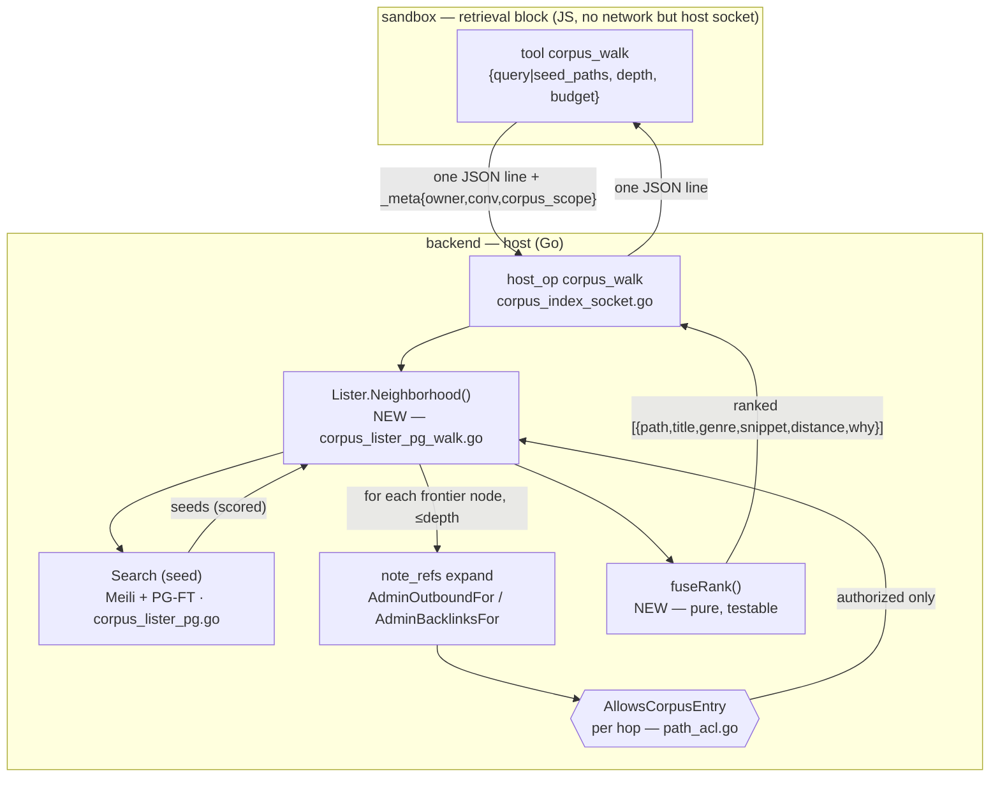
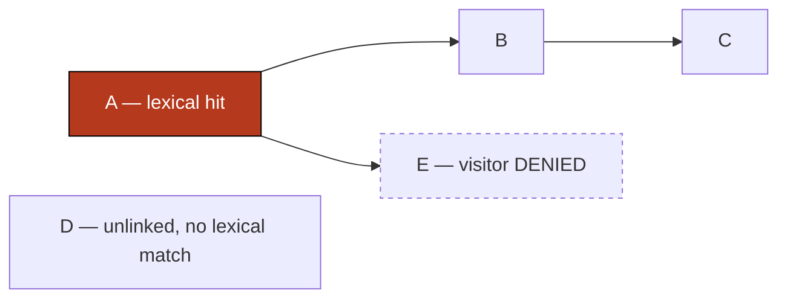

# Corpus graph retrieval — server-side bounded walk + fused ranking (roadmap 1b)

> **Status:** design, red-first tests owed. Grounds the 🟡 in roadmap 1b.
> **One line:** search finds an entry point; then the server walks the owner's
> `[[link]]` graph outward a bounded depth, ACL-checking every hop, and returns
> one ranked list that fuses lexical relevance with graph proximity — instead of
> the agent driving the hops one `corpus_links` call at a time.

## What is already there (do not rebuild)

The graph, the edges, the 1-hop walk, and the per-node ACL gate all exist. The
retrieval capability is a sandboxed JS block that reaches host data over a unix
socket; every host op it may call is a fixed verb declared in its manifest.

| piece | where | note |
|---|---|---|
| the block | `backend/blocks/corpus.retrieval/manifest.yaml` | `sandbox_stdio` → `node /plugin/retrieval-mcp.js`; 8 `host_ops` |
| reach-back | `infra/plugins/retrieval/gateway.js:12` `callHost()` | one JSON line over `STANDMEET_HOST_SOCKET`, `STANDMEET_NATIVE_KEY` auth |
| host dispatch | `backend/internal/corpus/usecase/corpus_index_socket.go:47` `CorpusHostOps` | builds one `hostop.Op` per verb |
| full-text seed | `corpus_lister_pg.go:64` `Search` | Meili (wiki/output/subjectivity) + PG-FT (writings); **score discarded** |
| edges | `note_refs` (`db/schema.sql:305`) | `(src_id,dst_id,owner_id)`, **no `kind` column**; resolved `[[Title]]` links, rebuilt on save (`wiki_crosslink.go:113`) |
| 1-hop walk | `corpus_lister_pg_links.go:22` `Links()` | `AdminOutboundFor` (out) + `AdminBacklinksFor` (in) |
| per-node ACL | `access/entity/path_acl.go:143` `AllowsCorpusEntry` | via `allowsCorpusEntry(scope,genre,path,published)`, called on **every** row/neighbor |
| the anti-leak pattern | `corpus_lister_pg_links.go:74` `neighborMeta` | drops a neighbor the visitor can't read **before** exposing it |

## What is missing (this design)

1. **A server-side bounded walk** — seed → expand N hops → collect, in one call.
2. **Fused ranking** — one list ordered by (lexical relevance × graph proximity),
   not two separate surfaces the agent stitches together.

Both are pure composition over the primitives above. The only genuinely new code
is the walk loop, the rank function, and surfacing the Meili score that `Search`
currently throws away.

## Architecture



Example graph the walk traverses (edges = resolved `[[links]]`):


`corpus_walk(query→A, depth=2)` returns **A, B, C**; never **D** (off the graph,
no match) and never **E** (linked but ACL-denied — the load-bearing guarantee).

## The new capability

**`corpus_walk`** — one visitor tool + one host op (rides the existing socket
vocabulary; no new transport).

- **args**: `query?: string` (lexical seed) **or** `seed_paths?: string[]`;
  `depth?: int` (default 2, hard max 3); `budget?: int` (default 24 nodes).
- **returns**: `{ nodes: [{ path, title, genre, snippet, distance, why }] }`
  — `distance` = hops from nearest seed (0 = seed); `why` ∈ `matched | linked`.

Seams to touch (all named by the audit):
1. `Lister` interface `corpus_lister.go:67` — add `Neighborhood(ctx, ownerID, scope, seedQuery/seedPaths, depth, budget)`.
2. `pgCorpusLister` — new `corpus_lister_pg_walk.go`; compose `Search` (seed) +
   `AdminOutboundFor`/`AdminBacklinksFor` (expand) + `neighborMeta`/`allowsCorpusEntry` (gate).
3. `CorpusHostOps` decl slice `corpus_index_socket.go:68` — add `{runCorpusWalk, "corpus_walk", "..."}` + a `marshalWalk` wire func.
4. `manifest.yaml` — add `corpus_walk` to `visitor_tools` **and** `host_ops`.
5. `retrieval-mcp.js` — register `forward('corpus_walk')`.

## Ranking

`fuseRank` is a pure function (testable like `BuildCorpusMap`). Heuristic:

```
score(node) = w_lex · lexScore(node)            # 0 if not a lexical hit
            + w_prox · 1/(1 + distance)          # graph proximity to nearest seed
            + w_deg  · min(indeg_from_frontier, cap)   # linked from many seeds ⇒ higher
```

- Seeds keep Meili relevance order among themselves.
- A node reachable from **two** seeds outranks one reachable from **one** (the
  `w_deg` term) — this is the assertion that proves fusion happened, not concat.
- <!-- ponytail: fixed weights, no typed edges. note_refs has no `kind` column,
     so out-vs-backlink is the only edge signal; add a `kind` column + retune only
     if fused rank measurably needs cites/read-next weighting. -->
- Requires surfacing the Meili score: add a score field to `search.Doc` /
  `SearchRequest` in `corpus/search/search.go` (today the only place data is dropped).

## ACL — the guarantee that must be falsifiable

Every expanded node passes `allowsCorpusEntry(scope, …)` **before** it enters the
frontier or the result — the same gate `neighborMeta` already applies. A denied
node is never enqueued, so its own neighbors are never discovered either (no
transitive leak). The frozen `CorpusScope` arrives whole via `_meta` and is used
whole (`corpusScopeOf`, socket:340) — the walk never rebuilds it from wire fields.

## Test plan — red-first, black-box e2e

Drive through a real visitor session's tool call (the capability, not a UI face);
seed the corpus via owner MCP (`corpus.create` + `corpus.promote`) so real
`note_refs` edges are built by the production save path. Assert only on returned
`path`s — never internal tables. **Red today**: `corpus_walk` does not exist, so
the tool is absent / errors; each test goes green when the walk lands.

Fixture graph (owner-created wiki notes, real `[[links]]`): `A → B → C`,
`A → E`, plus unlinked `D`. A visitor code grants `A,B,C,D` but **denies `E`**.

| # | test | drives | asserts (observable) | fails if |
|---|---|---|---|---|
| 1 | seed appears | `corpus_walk(query="…A…", depth=2)` | result contains `A` (distance 0, why=matched) | seed not returned |
| 2 | walks outgoing to bounded depth | same, depth=2 | contains `B` (dist 1) and `C` (dist 2) | graph not walked |
| 3 | depth bound holds | depth=1 | contains `A,B`; **not** `C` | depth ignored |
| 4 | off-graph excluded | depth=2 | **not** `D` (no link, no match) | walk leaks unrelated nodes |
| 5 | **ACL anti-leak** | depth=2, code that denies `E` | **never** `E`, though `A→E` exists | ⚠ BFS skipped per-hop ACL — the security bug this spec exists to catch |
| 6 | backlinks direction | seed `C`, depth=1 | contains `B` (in-edge `B→C`) | walk only follows out-edges |
| 7 | fusion, not concat | graph where `X` is linked from two seeds, `Y` from one | `X` ranks above `Y` | rank is proximity-blind (mere concatenation) |
| 8 | budget caps size | large graph, budget=5 | ≤ 5 nodes returned | unbounded fan-out |

Guard discipline: #5 must go **RED on a walk that forgets the per-hop gate**
(prove it by temporarily bypassing `allowsCorpusEntry` in the walk — it must
surface `E`); that is the [[guard-must-fail-on-the-bug]] check. #4/#5 are written
as "contains the survivors, never the excluded one" with the excluded node named,
never a bare `.not` on an empty result ([[dont-write-absence-tests]]).

Pure-unit companion (not primary): `fuseRank` and the walk's frontier/dedup logic
get one Go table test (deterministic, no DB) — the walk loop is the one piece with
branching worth a fast check.
