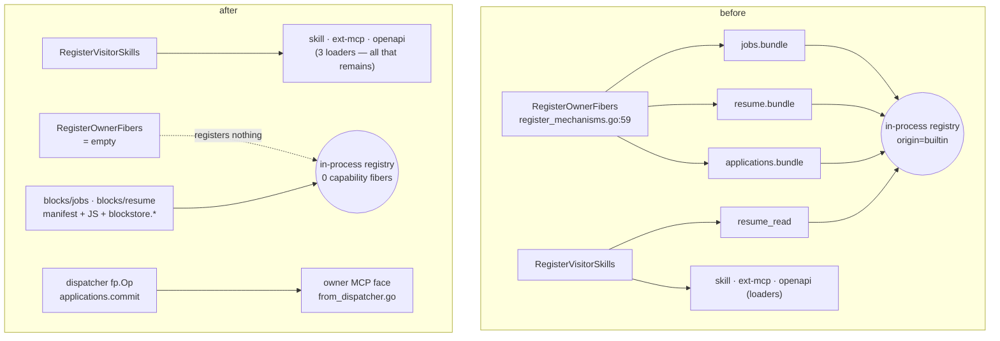
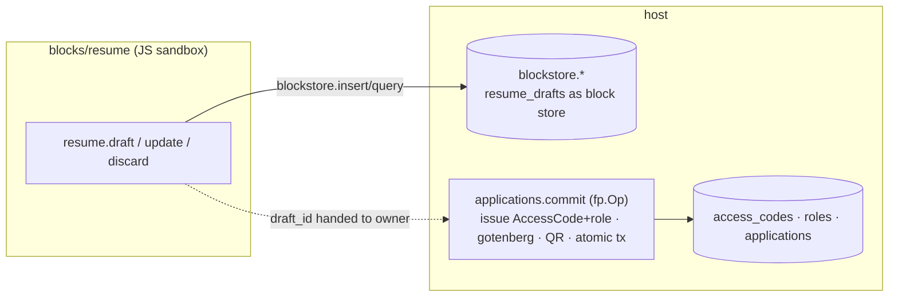

# Layer ② — retire the last in-core capability fibers (roadmap 块二 层②)

> **Status:** design, red-first tests owed. Grounds the 🟡 in roadmap 块二 层②.
> **One line:** the everything-is-a-block migration externalized every
> visitor/leaf capability and every connector; the only feature-named things
> still `MustRegister`ed into the in-process registry are the job-loop trio
> (`jobs` / `resume` / `applications`) + `resume_read`. This closes them out so
> the core holds **zero Go-implemented capability fibers** — only structural loaders.

## The target, stated precisely

`Shipped()` (`plugin/registry/shipped.go:30`) **cannot** reach literal zero: the
externalized manifest blocks under `backend/blocks/` (calendar.book, corpus.retrieval,
mail.send, ask_visitor, summarize_conversation) are registered `OriginBuiltin`
too (`blockwire/block_register.go:55`) even though their code is already external
node servers. So "count to zero" means the reachable, meaningful target:

> **Zero in-core Go-implemented capability fibers.** `RegisterOwnerFibers`
> (`register_mechanisms.go:59`) registers nothing; only the three structural
> **loaders** remain. Every feature-named owner tool is then either a manifest
> block or a dispatcher `fp.Op` — the star-topology the file header calls out
> ("one line per feature") is gone.

## What still MustRegisters, and its fate

`backend/internal/routes/blockload/register_mechanisms.go`:

| fiber | line | kind | fate |
|---|---|---|---|
| `skillRunnerFiber` | 40 | **loader** (runs owner-authored skills) | **stays** — names no feature |
| `NewExtMCPLoader` | 43 | **loader** (dials owner-registered MCP) | **stays** |
| `openapiAgentToolsFiber` | 44 | **loader** (exposes a connected spec's ops) | **stays** |
| `resume_read` fiber | 50 | capability (job-loop reader) | **goes** — moves with `resume.*` |
| `jobs.OwnerFibers()` → `jobs.bundle`/`resume.bundle`/`applications.bundle` | via `boot_wireup.go:183` | **capability** | **goes** — see split below |

The three loaders "name no feature" and stay four lines forever (file header
`register_mechanisms.go:1-17`). The migration empties `RegisterOwnerFibers` and
deletes `resume_read` from `RegisterVisitorSkills`.

## Decision — SPLIT (route each tool to its cheapest correct home)

Two exits already exist for a tool to leave the fiber registry, and the goal is
satisfied by **either**. Route by what host state the tool touches:

- **`jobs.*` + `resume.*` → a block** (the `calendar.book` template). They touch
  only generic host stores — a **Redis 24h pool** (`cache/pool.go:34,89`) and one
  DB table each (`job_sources`, `resume_drafts`) — a clean `blockstore.*` fit,
  connector-free. This matches the platform-architecture.md target ("job-loop →
  standard MCP server, owner-only").
- **`applications.commit` → a dispatcher `fp.Op`** (the `me`/`seo`/`codes`
  template — stays host-owned Go, just off the fiber registry). It is the
  product's **deterministic state holder** (CLAUDE.md): AccessCode issuance **with
  a role grant** (`applications.go:205-220`), gotenberg render-before-commit
  (`applications.go:125-147`), QR/URL, and an atomic 3-table transaction. Pushing
  AccessCode issuance — an authz primitive — through a sandbox would (a) cross the
  trust boundary the feature floor reserves for core, and (b) force a
  domain-named host verb like `accesscode.issue`, which `check-host-blind-to-blocks.sh`
  forbids. `blockstore.*` is KV-ish per-block storage, not cross-domain ACID.

**Tie-breaker, resolved:** `integration-job-loop.spec.ts` asserts only outcomes —
recruiter scans QR → lands in ChatRoom (`:48`), owner sees the application row
(`:57`), the persona names the job "Airbnb" (`:77`). It does **not** assert "one
MCP server", so the split satisfies it unchanged.

## Architecture — before / after

## Migration steps (each keeps the net green)

1. **`applications.commit` → `fp.Op`.** Declare `ApplicationOps() []fp.Op` in
   `owner/ops` (mirror `owner/ops/account.go:46`); add one line to
   `dispatcher.Collect` (`wire/dispatcher.go:50`); delete `applications.bundle`
   from `OwnerFibers`. Behavior identical — the `integration-job-loop` floor holds.
2. **`resume.*` → `blocks/resume`.** Manifest (`sandbox_stdio` + node) + JS server;
   `resume_drafts` becomes a `blockstore` collection; drop `resume.bundle` +
   `resume_read` fiber. The hourly `SweepExpired` (`jobs.go:86`) stays host-side
   (periodic scheduler is core), reading the block's store — or expires via TTL.
3. **`jobs.*` → `blocks/jobs`.** Manifest + JS; the Redis pool + `job_sources`
   become `blockstore` collections. `fetch_new` reasoning stays in the owner's
   Claude; the block holds the deterministic pool/dedup.
4. **Empty `RegisterOwnerFibers`.** Delete the `jobs.OwnerFibers()` wiring at
   `boot_wireup.go:183`. Only the three loaders remain.

Order is dependency-first: `commit` (1) is independent; `resume`/`jobs` (2,3) can
land in either order; (4) is the last, once nothing feeds `RegisterOwnerFibers`.

## Feature floor — must not shrink (P.1c)

`platform-architecture.md:328-349` locks, per capability, the gating/state that
must survive: for the job loop (`:342`) — `register_source / fetch_new /
resume.draft / applications.commit + auto-issue AccessCode`, floored by
`integration-job-loop`. The cross-cutting framework (`capability_state`,
`enabled=false 但可见`, prompt fragment+hash, ACL, quota, connector-dep gate,
Close-hook, `ErrHidden`, mode gating) **stays in core** — the block only supplies
tools/instructions. Guards that must stay green through the migration:
`check-host-blind-to-blocks.sh` (no block id as a Go literal outside `blocks/`),
`check-core-seals-only.sh`, `check-core-agnostic`.

## Test plan — red-first

A structural migration's acceptance is **behavioral floor stays green + a new
structural guard flips red→green** — not a pixel of behavior changes.

**A. Behavioral floor (must stay GREEN throughout — these are not the red):**

| spec | asserts | why it's the floor |
|---|---|---|
| `integration-job-loop` | QR→ChatRoom, application row visible, persona names the job | the whole loop's outcome survives the split |
| a `resume.draft` e2e (owner MCP) | draft created, `draft_id` + `job_snapshot` returned | `resume.*` works as a block |
| a `jobs.fetch_new` e2e (owner MCP) | source registered → job lands in pool → `show` returns it | `jobs.*` works as a block |
| `norm-outward-toolset` golden | owner MCP still exposes `jobs.*`/`resume.*`/`applications.commit` tool names | externalization did not drop a tool |

**B. The structural guard (RED today → GREEN when the fibers are gone):**

- New `check-no-core-capability-fibers.sh` (or a Go test on the wired registry):
  assert `RegisterOwnerFibers` registers **zero** fibers and only the three
  named loaders remain in `RegisterVisitorSkills`. **Red today** (jobs trio +
  `resume_read` still registered); green when steps 1-4 land. Self-test: a planted
  extra fiber must make it red ([[guard-must-fail-on-the-bug]], [[gate-can-go-blind]]).

**C. Host-blindness (must stay GREEN):** `check-host-blind-to-blocks.sh` — the new
`blocks/jobs`, `blocks/resume` ids must not appear as Go string literals outside
`backend/blocks/`. `applications.commit` as an `fp.Op` names no block, so it is
clean by construction.

Discipline: B is the only red-by-design guard; A is the regression floor that must
never go red during the migration (run the relevant specs after each of steps 1-4,
not only at the end — [[full-suite-catches-scoped-gaps]]). Do **not** add an env
knob to toggle the old path ([[no-env-knob-for-test-convenience]]); land each step
whole.
