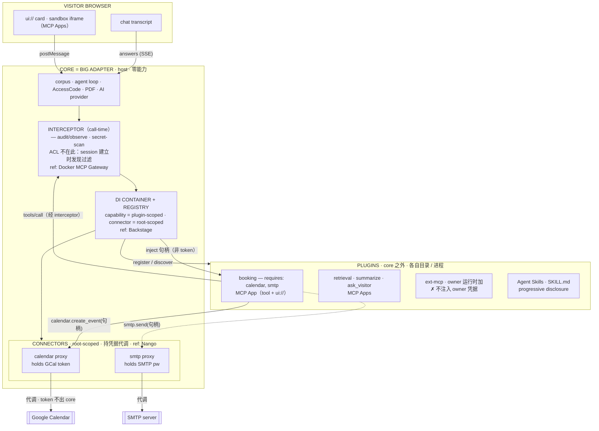
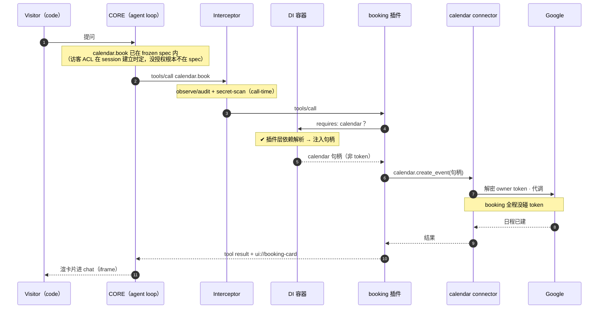

# StandMeet 平台架构（总设计）—— 大 adapter：core 零能力，能力 / connector / skill 全外置

> **状态：** 设计中（2026-06-18 起草，改为「替换」框架后升级为总设计）。统辖 task #134（MCP Apps）+ #135（注册/发现）+ 整个 host / connector / as-MCP-server 三朝向。
> **范围：** 这是 StandMeet 的**总架构设计** —— 把"大 adapter"夹的两类东西（inward 能力 / outward connector）、三个朝向、权限与观察两个横切 controller、以及全部 admin surface 的归位，统一定下来。实现拆解见 [`platform-architecture-tests.md`](platform-architecture-tests.md)。
> **读者：** 实际要写这套的人。默认你已读 `CLAUDE.md`、读过 MCP 规范的 lifecycle / tools / transports 三页。
> **怎么反馈：** 每块结尾有编号决策点（`P.1`、`P.2`…）。回 `Pₙ: accept` 或 `Pₙ: change — <理由>`。没提到的视作 accept。

---

## TL;DR — 一句话讲完

**这是替换，不是共存。** 终点态：

- **core = corpus + visitor chat + AccessCode + PDF + AI provider + 一个插件装载器。零能力。** 现有 `MustRegister`（agentskills 内建能力）+ 进程内 `plugins.Registry`（job-loop 那套）**全部删除**。
- **每个能力 + 每个 skill（retrieval / booking / email / skill-runner / ext-mcp / job-loop …）迁出到自己的目录**，各自是一个**标准 MCP server**。不在主 backend、不在主 frontend。
- **docker-compose 起来时，一个个当 builtin MCP/skill 装载**进 core（开机注册，不是编译进去）。"builtin" = 随产品发的默认插件集，compose 时加载 —— 架构上照样在 core 之外。owner 运行时还能再加自己的（ext-mcp 那条路）。
- frontend 同理：能力 UI 卡片不写死，走 MCP Apps（`ui://`），插件自带。

机制完全照抄 **MCP 协议**：声明（manifest）→ 发现（dial + `tools/list`）→ 调用（`tools/call`），传输走 MCP 两条标准管道（stdio / Streamable HTTP）。

---

## 架构总览

StandMeet = 一个**大 adapter**，夹在两类东西之间：inward 能力（MCP Apps）↔ outward 带凭据的 connector（Nango-proxy）。每层标了它借鉴的开源参考。



一次 booking 调用的流向（① → ⑨）：



| 层 | 是什么 | 参考 |
|---|---|---|
| 能力（inward, 无密） | MCP App（plugin-scoped 插件） | MCP Apps |
| connector（outward, 持密代调） | root-scoped proxy 服务 | Nango |
| host 接线（capability ← connector） | DI 容器 + scope | Backstage |
| call-time 关卡（审计·观察 / 防泄漏；**ACL 不在此 —— session 建立时发现过滤，见 P.11**） | interceptor 中间件 | Docker MCP Gateway |
| 能力 ↔ 凭据 分离 | piece ↔ connection | Activepieces |

---

## StandMeet 的三个朝向（对外 / 对内关系全图）

StandMeet 同时扮演三个角色，凭据方向各不同，别混：

| 角色 | StandMeet 是 | 对面 | 凭据方向 |
|---|---|---|---|
| **host（大 adapter）** | MCP client / host | 能力插件（MCP App） | — |
| **connector-owner（伸手出去）** | 持密调用方 | Google / SMTP / Obsidian | 持**别人的**密，认证**出去** |
| **MCP server（反转）** | MCP **server** | owner 的 Claude Desktop / Cursor / Claude Code | owner 持 **StandMeet 发的 key**，认证**进来** |

**第三个（as-MCP-server）是个聚合 facade**：把所有插件的 owner-facing 工具（各 `OwnerMCPBindings`）汇成**一个 MCP 端点**给 owner 的站外 host。跟 visitor 侧**同一个 gateway 模式**（Docker MCP Gateway / ContextForge），只是消费者不同：
- **visitor 侧**：聚合插件工具 → 站内 agent loop（访客 AI）。
- **owner 侧（反转）**：聚合插件 owner 工具 → 站外 host（owner 的 Claude Desktop）。

插件化后**自动受益**：每个插件声明自己的 owner-facing 工具，facade 自动汇入对外端点，core 不写死。已存在：owner-MCP + keypair 签名 + `@standmeet/mcp-client` SDK（`c3-mcp-client-stdio` spec）。

**决策点 P.10：StandMeet 三个朝向（host / connector-owner / as-MCP-server）。as-MCP-server 是 registry 的对外脸，聚合插件 owner 工具成单端点；与 visitor 侧同一 gateway 模式。**

---

## 全貌覆盖（以测试为准）—— 26 个 admin surface 的归位

审计了全部 admin section + 225 个 e2e（详见审计），每个 surface 都有归处，没有无家可归的：

| 桶 | surfaces | 在本架构里是什么 |
|---|---|---|
| **能力（A）** | （booking/retrieval 等，非 admin section） | → MCP App 插件（注册式） |
| **authored artifact（A2）** | prompts · skills · agent-skills | → 内容库（prompt + skill 同族，CRUD/marketplace/挂 role）；skill 走 Agent Skills + skill runtime |
| **connector（B）** | connectors（calendar/mail）· obsidian · sources | → connector 层（action / sync） |
| **corpus（C）** | raw · wiki · output · writings · seo | → core 数据（owner 内容仓 + 策展） |
| **as-MCP-server（D）** | api-mcp · keypair | → 对外 facade（owner 的 Claude Desktop 连进来） |
| **权限控制器（E）** | roles · codes · prompts · ip-bans/security | → host 横切 controller #1（ACL，**session 建立时的发现/装配过滤**，非 call-time 拦截） |
| **观察器（F）** | **系统可观测**：system（版本/资源/job/health/指标）· activity-ticker；**会话观测（产品侧）**：conversations · dashboard · requests · preview · ghost 日志 | → host 横切 controller #2 = **系统可观测 → admin/system（#101）**；会话观测属产品/内容侧，**非** host controller |
| **page 托管（G）** | page · custom-pages · preview | → SDK + 沙箱页托管 |
| **outbound/job（H）** | applications · drafts · listings · sources | → job-loop 插件 |
| **account（I）** | account · security | → 账户/认证 |

### 两个横切 controller —— 时机/机制不同，别混成一层 inline interceptor
host 有两个横切 controller，但它们**作用时机和机制完全不同**，**不是** Docker MCP Gateway 那种「每次 call 都过同一道 inline 中间件」：

- **权限控制器（ACL）—— 作用在 session 建立时，机制是「不被发现」而非「被拦截」。**
  session/code 建立时 role snapshot 被 frozen（`RoleSnapshot` / `AllowedTools` / corpus_uris / mcp_server_ids）。装配 visitor 工具时（`AssembleVisitor` / `VisitorToolSpecs`），没授权的插件 tool 直接 `ErrHidden` —— **压根不进这个 session 的 tool spec**，访客的 AI 从来没见过它。所以**没有逐次调用再判一道**这回事：判定一次性发生在 **session 边界**。roles（prompt + corpus glob + skills + mcp_servers）+ codes（quota + assumed_role）+ ip-bans。**已全 + 测试扎实**（`iam-role-*` / `admin-codes-*` / `admin-ip-bans`）。
  （注：call-time 还有一道**插件层**依赖解析 —— `requires: calendar` → 注入 connector 句柄；那是 DI/connector 依赖解析，不是访客 ACL。）
- **观察器 —— 作用在 call time，是系统可观测面（→ admin/system）。** 每个插件调用经过时吐 telemetry（谁、调了什么、量/延迟/health）→ 喂 **admin/system**（版本/资源/后台 job/health/指标，#101 现在还是硬编码、health 假 OK）+ activity-ticker 实时流。插件化后自动受益：观察的是这一层，不管 tool 来自哪个插件。**待补**：admin/system 接真后端 + activity-ticker 实时流（现 placeholder）。
- **secret-scan** —— call-time 防泄漏，跟观察器同侧（真正的 inline 中间件）。

→ 只有**观察器 + secret-scan** 才是 Docker MCP Gateway 那种 call-time inline 三件套；**ACL 不是** —— 它是 session 建立时的发现/装配过滤，决定哪些插件 tool 进得了这个 session 的 frozen spec。

> **注意区分**：conversations 转录（ghost 日志 / tool calls / citations）、dashboard KPI 是**产品/内容侧**对「会话里发生了什么」的读，**不是** host 观察器 controller；也**不是**那个已废弃的 observe-and-distill 蒸馏引擎（`observer-deprecated`，方向已死，不碰 corpus、不蒸馏、不写内容）。

### 归桶有歧义的（Z，记一笔，不阻塞）
- **seo** —— 设置 + 监控混在一节，可拆（设置归 account、indexing 统计归观察器/系统面）。
- **sources / listings** —— admin 只读，生命周期在 MCP（job-loop 插件）——不对称，要么补 admin CRUD，要么明确"MCP-owned"。

**决策点 P.11：host 有两个横切 controller，时机/机制不同 —— ① 权限控制器（ACL）作用在 session 建立时，机制是「不被发现」（`ErrHidden`，不进 frozen spec），非 call-time 拦截；② 观察器作用在 call time，是系统可观测面（→ admin/system，#101）+ activity-ticker 实时流。只有观察器 + secret-scan 是 call-time inline 中间件，ACL 不是。conversations/dashboard 等会话观测归产品/内容侧，不是 host 观察器。Z 项（seo/sources/listings）记为归位歧义，不阻塞主线。**

---

## 为什么能做 —— 既成事实 + 要删的

1. **`agentskills.Capability` 是唯一接缝。** 下游全部（`AssembleVisitor` / `VisitorToolSpecs` / system prompt / owner MCP）只 walk `Registry.List()`。能力**从装载器**注册进去，下游一行不用改。
2. **`ext-mcp` 是活模板（且本来就标准）。** `agentskills_ext_mcp.go` 干的就是：dial 外部 MCP server → `ListTools` → 每个 tool 包成 `BindingTool`。这正是 MCP 的 `tools/list`。它是「owner 运行时」那一侧，已经是标准，**保留并泛化**。
3. **要删的（replace 的对象）：** ① agentskills 里所有 `MustRegister(newXxxCapability(...))` 内建能力实现，迁出成独立 MCP server；② 进程内 `internal/plugins`（`Plugin`/`CapabilityRegistrar`，job-loop 在用）—— 不理想的 ad-hoc 模式，job-loop 也迁成标准 MCP 插件后删除。
4. **缺口很精确。** 缺：manifest、装载器（发现来源）、`_meta` 袋、版本协商、**Go 端 stdio 传输**（现有 stdio 是 JS SDK 反方向）。

---

## MCP 协议给的设计（我们照抄，不发明）

**注册/发现 —— 三段分离**（lifecycle + tools 两页）：

| MCP | 含义 | 我们对应 |
|---|---|---|
| capability 协商（`initialize`） | 声明「我有哪些**类别**」+ 子能力（`listChanged`/`subscribe`），版本化、可拒绝 | **`PluginManifest`**：id / version / shape / transport / ui? |
| `tools/list`（带 cursor） | 运行时 pull 具体清单 | dial transport → ListTools（泛化 ext-mcp） |
| `notifications/tools/list_changed` | server 推「清单变了」 | （v2）装/卸触发重新发现 |
| `_meta["ui/resourceUri"]` | UI 不 fork 协议，挂 metadata | manifest `ui{resourceUri,mimeType}` → `CapabilityState.Extra`（#134） |

**传输 —— 协议定死的两条管道**（transports 页，JSON-RPC over：）：

- **stdio**：core 把插件当**子进程拉起来**，走 stdin/stdout（newline 分隔，stdout 只能是 MCP 消息）。协议说「能用 stdio 优先」。**我们还没有。**
- **Streamable HTTP**：插件作为**独立服务**跑着，单端点，POST 上行 / GET+SSE 下行，`Mcp-Session-Id` 头管会话。**`mcpclient.Dial` 已实现。**

→ 插件 manifest = **我们版的 MCP server 配置**：每条要么 `{command,args,env}`（stdio）要么 `{url,headers}`（http）。装 docker 时往这个配置加条目 = 装插件。

**决策点 P.1：照抄 MCP，不发明私有协议。** 传输两种都支持（http 复用 mcpclient，stdio 新写），每个插件在 manifest 里自己声明用哪种。

---

## 两套标准，不是一套：MCP ≠ Skill

externalize 的东西分两类，走**两个不同的开放标准**，装载器要认两种 plugin kind：

| | MCP 能力 | Skill |
|---|---|---|
| 标准 | **MCP**（wire protocol，client↔server JSON-RPC） | **Anthropic Agent Skills**（文件夹 + `SKILL.md`） |
| 形态 | 一个跑着的 server，运行时 `tools/call` | 一个目录：`SKILL.md`（YAML frontmatter: name+description）+ 正文指令 + 附带 scripts/resources |
| 加载 | dial + `tools/list` | progressive disclosure：启动只读 name/description，相关时读正文，再按需读附件 |
| 谁是它 | booking / retrieval / ext-mcp / job-loop | owner-curated skill（现 `skill.runner` 跑的脚本） |

→ booking/retrieval 这些 = 标准 **MCP server**；owner 的 skill = 标准 **Agent Skill**。都迁出 core，但**两套机制**。现有 `skill.runner`（沙箱跑 owner 脚本）重写成 Agent Skills 格式。

**决策点 P.1b：MCP 能力走 MCP server，skill 走 Agent Skills（SKILL.md）；装载器两种 kind 分别处理。**

### skill 的「插入」≠ MCP 注册 —— 它跟 prompt 同族
skill 不是个跑着的 server，是 owner **author / 从 marketplace 装**的**内容工件**（SKILL.md：指令 + 可选脚本）。它的管理方式跟 **prompt 一模一样**：

| | MCP 能力 | **skill** | prompt |
|---|---|---|---|
| 本体 | 跑着的 server | SKILL.md 文件夹 | 一段人设文字 |
| 插入 | 注册 / dial server | **库里 author / marketplace 装** | 库里写 |
| 加载 | tools/list + tools/call | progressive disclosure + 沙箱跑脚本 | 拼进 system prompt |
| 管理 | 注册表 | **内容库 + CRUD + attach to role** | **内容库 + CRUD + attach to role** |

→ **skill + prompt = 「authored artifact」家族**：owner 自管的内容库，CRUD、挂 role、喂进 AI 上下文。跟"注册一个跑着的 MCP server"是两回事。owner 要的"一套管理系统" = **skill 复用 prompt 那套管理范式**（`PromptsSection` 是现成模板）。现状已有料但散：`AgentSkillsSection`（installed + marketplace）+ `SkillsSection`（persona skills CRUD）+ `PromptsSection` —— 要理成 skill 与 prompt **对等的两套管理面**。

→ 所以 host 有**两套装载机制**，别混：① MCP 能力 = dial server → 路由 tools/call（注册式）；② skill = 从内容库取 SKILL.md → progressive disclosure 喂上下文 + **skill runtime**（沙箱跑 bundled 脚本）。标准是 Agent Skills，管理面是我们自己的（对齐 prompt 管理）。

**决策点 P.1d：skill 归「authored artifact 家族」（与 prompt 同族），不是 MCP 能力。skill 复用 prompt 的管理范式（库 / CRUD / marketplace 装 / 挂 role）；标准走 Agent Skills（SKILL.md），host 提供 skill runtime（progressive disclosure + 沙箱）。**

### skill 机制设计 —— 抄 Agent Skills，现状已 ~90%
现状 `skills` 表（`name · description · prompt · scripts · allowed_tools · enabled · is_builtin`）+ marketplace（`skillsmp.go`）+ role_skills + CRUD（`SkillsSection`）—— **字段几乎 1:1 对上 Agent Skills**，管理面/marketplace/enable/挂 role **都已存在**。

| Agent Skills | 现状 | 动作 |
|---|---|---|
| SKILL.md（name + description + body + bundled scripts） | DB row | 序列化 / 导入成 SKILL.md（DB 仍是管理存储，render 成 SKILL.md 喂 runtime） |
| `license`（可选 frontmatter） | — | 加一字段 |
| **progressive disclosure**：L1 名+述常驻系统提示 → L2 触发读正文 → L3 脚本 bash/沙箱按需跑（脚本码不进上下文，只回输出） | **eager**：每个 script 直接成 LLM tool `skill_<name>_<script>`；正文走 persona 通道 | **唯一真改**：换成三级渐进加载 |
| name ≤64 kebab、description ≤1024、不含 XML/`anthropic`/`claude` | 无约束 | 加校验 |

**目标加载模型（faithful Agent Skills）**：L1 把 role 授权且 enabled 的 skill 的 `name+description` 注入系统提示；agent 判定相关 → 经一个 `use_skill(name)` tool 读回正文（L2）；正文引用的脚本经现有 `sandbox.Runner` 按需跑、只回输出（L3）。**替换掉**"每个 script 预先暴露成 tool"。

参考：[anthropics/skills](https://github.com/anthropics/skills)（SKILL.md 格式 + 真例）、Claude Code 目录式 skill 加载。

**决策点 P.1e：skill = DB 管理 + render 成标准 SKILL.md + 三级 progressive disclosure 加载（替换 eager tool-per-script）。format/marketplace/enable/挂 role 已具备，只补 SKILL.md 序列化 + 渐进加载 + 字段校验。**

---

## 能力不能少 —— 外置后的功能下限（feature floor）

外置 = 换承载方式，**功能一个都不能丢**。下面是测试锁死的下限，externalize 后必须逐条仍然成立（括号是锁它的 spec）。**关键：这些 gating/state 大多是 StandMeet 特有、标准 MCP/Skill 本身没有的 → 留在 core 当「插件宿主」职责，插件只提供 tools/instructions，core 把这套框架套在插件产出的 tool 上。**

**retrieval → MCP server**：3 tool（corpus_search/read/list）；ACL gated on role.corpus_uris；空 corpus → `enabled=false` 但**仍可见**（降级提示，不是消失）；贡献 system-prompt fragment + 进 part_ids + 影响 hash。（`retrieval-capability-state` / `session-capability-bundle`）

**booking → MCP server**：2 tool（calendar_book + calendar_list_slots 只读不走 quota）；完整 gating 链 —— mode=code only（public/byoai 永不见，`chat-book-public/byoai-denied`）、role ACL（`chat-book-skill-not-granted`）、**connector 依赖**（GCal 未连/OAuth 未完 → 隐藏，`chat-book-not-connected`）、**quota**（max_bookings 耗尽 → tool 消失非报错 + quota_remaining + 跨 tool 实时重算，`chat-book-quota-exhausted` / `tool-endpoint-state-cascade`）、booking 政策（conflict/busy/leadtime/weekend/hours 四个 `chat-book-conflict-policy-*`）、token 刷新（`chat-book-token-refresh`）、约成通知 owner（`booking-owner-notify`）、session email 默认（`chat-book-session-email-default`）、schema 拒半 args（`chat-book-schema-rejects-partial`）、访客取消自己的约（`visitor-cancel-booking` / `tool-calendar-cancel-booking`）。

**email（确认信）→ 确定性 flow（非 AI tool）**：**SMTP connector 依赖**（没连 → 卡片不渲 email 区，`booking-confirmation-email` no-connector）；HTML + schema.org EventReservation；收件人硬控（引用 session email / 透传 / 校验非法 422 / skip）。

**skill → Agent Skill**：owner 脚本 + allowed_tools；ACL（role 授权）；`skill.runner` enabled 当 role 含 skill；tool_specs 含 tool_<skill>_*；沙箱执行。（`tool-endpoint-skill` / `b3-bundle-capabilities`）

**ext-mcp → MCP server（owner 运行时来源，已标准）**：dial→list→`ext_<server>_<tool>`；ACL via role.mcp_server_ids；不可达 → 静默隐藏（ErrHidden）；**Close hook 释放 session**（dial/close 计数对账）；加密 auth header。（`tool-endpoint-ext-mcp` / `external-mcp-tools` / `b3-bundle-capabilities`）

**job-loop → MCP server（owner-only）**：register_source / fetch_new / resume.draft / applications.commit + 自动 issue AccessCode。（`integration-job-loop`）

**summarize / ask_visitor → MCP server**：summarize 出 HTML 报告落 chat_reports + PDF；ask_visitor deps-less + ReturnDirectly 结束 loop。（`visitor-summarize-conversation` / `visitor-ask-visitor`）

### 宿主必须继续提供的横切框架（标准 MCP/Skill 没有，core 留着）
`capability_state`（session + 每个 tool 响应里实时重算）、`enabled=false 但可见`（降级）、system-prompt fragment + part_ids + hash、ACL（role.AllowedTools / corpus_uris / mcp_server_ids）、quota、connector 依赖闸、Close-hook 生命周期、ErrHidden（干净隐藏 vs 报错）、mode gating（code/public/byoai）。

**决策点 P.1c：core 是「插件宿主」—— 上述横切 gating/state 全留 core，套在插件产出的 tool 上；externalize 不得削减任何一条 feature floor。每条都有现成 spec 看守回归。**

---

## 增强:in-app 依赖解析与注入（这是「增强版 MCP」的关键）

标准 MCP discovery（initialize / tools/list / transports）**不够** —— 它不知道 booking 插件需要 owner 连了 Google Calendar、email 插件需要 SMTP。我们的注册/发现机制要**增强**：插件能**声明它依赖哪些 app 内资源**，宿主负责**解析 + 注入**。

### 1. 宿主依赖提供方注册表（host dependency providers）
core 持有一组**命名 in-app 依赖**，每个背后是一个 connector + 凭据存储 + 生命周期：

| 名字 | 背后 | owner-facing |
|---|---|---|
| `calendar` | GCal connector（OAuth token） | admin connectors 页 |
| `smtp` | mail connector | admin connectors 页 |
| （将来 `corpus` / `accesscode` / `ai-provider` 等也可暴露成命名依赖） | | |

connector 的 **connect / OAuth / 存储 / admin UI 全留 core**（owner-facing 生命周期，本来就是 core 的）。

### 2. manifest `Requires: []string`
插件声明需要哪些命名依赖：booking → `Requires: ["calendar"]`，email → `Requires: ["smtp"]`。

### 3. boot 校验（fail fast）
装载时每个 `Requires` 名字必须是**已知 provider** → 否则拒绝注册 + log（跟 version 闸同性质：插件要的东西 core 给不了，就别上）。

### 4. per-session 解析 + 注入「句柄」，不是凭据（Nango proxy 模型）
某访客 session 装配插件时，对每个 `Requires`：
- **解析 owner 实例：未连 → 插件隐藏/降级**（这就是 feature floor 里 booking/email 的 connector-gating，统一到这一层，不再写死在 booker 里）。
- **已连 → 注入「服务句柄」，不是凭据**：connector 是个 root-scoped 的 **Nango 式 proxy** 服务，owner 的 token 锁在它肚子里。插件拿到的是一个经 host 路由的 `calendar` 调用句柄，调 `calendar.create_event(...)`，**凭据全程不进插件**。

→ 这样 **booking 的 Google 集成逻辑搬进 booking 插件，但 owner token 永不出 core**。booking「难搞」正因它挂 connector 上 —— 增强依赖解析就是为它（和 email）准备的承载。

### 5. connector 两个模式：action（proxy）/ sync（ingest）
connector 都是「host 带凭据向外延伸的手」，但有两种方向（= Nango 的两个原语）：

| 模式 | 数据方向 | 触发 | 例子 | Nango 原语 |
|---|---|---|---|---|
| **action** | 能力 → 外部（往外做事） | 访客 chat 里被能力 on-demand 调 | calendar / smtp | Proxy |
| **sync / ingest** | 外部 → corpus（往里灌内容） | 后台 / 定时，跟某次 chat 无关 | Obsidian / Notion 同步 | Sync（Functions） |

同一套 connector 抽象（同一份 provider 声明 + 同一个加密凭据 vault），只是模式不同。**Obsidian 不是新的第三类，是 sync 模式的 connector**：它接在 ingest 边（`vault → corpus`），再由 `retrieval` 能力服务访客，**永不进 visitor 的调用链**。

**安全**：owner 凭据**永不进插件**（Nango proxy 持密代调，插件只拿经 host 路由的调用句柄）。owner 运行时加的 ext-mcp **连句柄都不给**（owner 自己的外部 server，信任最低，要 owner 显式授权才接 dep）。

**决策点 P.9：增强 = 标准 MCP discovery + 依赖解析。manifest `Requires` 声明命名 in-app 依赖；connector = root-scoped Nango 式 proxy（持密代调），插件被注入的是「调用句柄、非凭据」；per-session 未连则 gate；ext-mcp 默认不接 dep，要 owner 授权。connector 分 action / sync 两模式，同一抽象，Obsidian = sync。**

---

## 设计 —— 三个新构件 + 一个泛化

### 1. `PluginManifest`（声明）
```
type PluginManifest struct {
    ID        string            // → Capability.ID()，唯一
    Version   string            // 协议/schema 版本，core 不兼容则拒绝
    Shape     agentskills.Shape // visitor_only / owner_only / both
    Transport PluginTransport   // stdio 或 http，二选一
    UI        *PluginUI         // 可选：{ResourceURI, MimeType}（#134）
    PromptFragmentID string     // 可选：system prompt 片段 id
}
type PluginTransport struct {
    Kind    string            // "stdio" | "http"
    Command string; Args []string; Env map[string]string  // stdio
    URL     string; Headers map[string]string             // http
}
```
工具不写在 manifest 里 —— 跟 ext-mcp 一样，dial 时 `ListTools` 现取（运行时发现，单一真相源）。

### 2. `PluginSource`（发现来源）
boot 时读 manifest 列表。v1 来源：一个配置文件（`STANDMEET_PLUGINS` 指向的 JSON/TOML，形如 Claude Desktop 的 `mcpServers`）。返回 `[]PluginManifest`。**这就是「无写死清单」** —— 清单来自部署，不来自代码。

### 3. `pluginCapability`（泛化适配器）
把 `manifest + 一个 transport-agnostic mcpclient.Session` 适配成现有 `Capability` 接口：`VisitorBinding` = dial transport → ListTools → 包成 BindingTools（**就是 ext-mcp 的 body，抽出 transport**），`_meta.ui` 塞进 `CapabilityState.Extra`。注册进 Registry 的就是它，一个 manifest 一个。

### 4. mcpclient 抽出 transport
现在 `mcpclient.Dial(url, headers)` 焊死 HTTP。抽一个 `Transport` 接口（读写 JSON-RPC 帧），HTTP 是一个实现，**新增 stdio 实现**（spawn 子进程 + stdin/stdout）。`Session` 之上的 `initialize/ListTools/CallTool` 不变。

**决策点 P.2：ext-mcp 与能力插件统一到同一 `pluginCapability`。** ext-mcp 退化成「owner 运行时来源的插件」，能力插件是「deployer 装机来源的插件」—— 同一适配器，只是 `PluginSource` 不同。（迁移留到后期，先并存。）

### 5. `Origin` —— 内建怎么跟插件区分
出身是**注册时的事实**，不是能力本身的属性 → 放 Registry，不污染 `Capability` 接口。三档 origin 对应三档信任：

| Origin | 来源 | 信任级 | 注册口 |
|---|---|---|---|
| `builtin` | 编译进二进制 | core 级（最高） | `MustRegister`（默认，不变） |
| `managed` | deployer 装机配置（PluginSource） | install 级 | `RegisterDiscoveredPlugins` |
| `owner` | owner 运行时填的外部 server（ext-mcp） | owner 级（最低） | owner 来源的 PluginSource |

为什么必须区分：①三档信任不同，P.4 边界靠它落地；②provenance 徽章（admin / capability map 标「内建」vs「插件:X」）；③迁移计数（`ListByOrigin(builtin)` 数出还剩几个内建没迁）；④防影子（插件撞内建 ID → **内建赢** + 拒 + log）。

实现：Registry 内部存 `{cap, origin}`；`MustRegister` 默认 `builtin`（向后兼容）；新增带 origin 的注册口；`List()` 不变，加 `ListByOrigin`；`CapabilityState` 加 `origin` 字段透到前端徽章。

**决策点 P.5：origin 是注册事实，存 Registry 不进 Capability 接口；内建撞名赢。**

---

## 管理面（management plane）—— 添加 / 删除 / 启用 / 关闭 / ACL

把"能力"的管理拆成**两条正交的轴**。关键：别把"存在"跟"可用"混成一件事。

### 轴一：存在性（existence）—— 谁控制它"在不在"。**由 Origin 决定。**

| Op | builtin | managed（装机） | owner（运行时） |
|---|---|---|---|
| **添加 add** | 编译时（代码） | 装机时（配置文件） | owner admin 填（已有：MCPServersPanel） |
| **删除 delete** | ❌ 不可删 | ❌ 运行时不可（改配置重启） | ✅ owner admin 删（已有） |

存在性 = Origin 的直接后果。这就是你说的「builtin 不能删除」。owner-origin 已经有完整 CRUD（`use-mcp-servers.ts`），managed/builtin 没有运行时删除入口 —— **删除按钮只对 owner-origin 亮**。

### 轴二：可用性（availability）—— owner 控制它"对访客开不开"。**三个门，对所有 Origin 一视同仁。**

一个能力真正暴露给某访客 session，要**同时**过：

1. **owner 启用（enable / disable）** —— admin 里一个开关。**这是新的** —— 今天没有「手动关掉一个能用的能力」，只能靠删。owner 关掉 ≠ 删除（builtin 删不了但**能关**）。存 `capability_settings(owner_id, capability_id, enabled)`，默认 enabled。
2. **connector 依赖满足** —— 能力声明它需要哪个 connector；没连上 → 自动隐藏（置灰 + "需要先连 Google Calendar"）。今天 booking / email 把这**写死在代码里**，要变成**声明式 + 统一闸**。
3. **role ACL 授权** —— `role.AllowedTools` 含该 capability id。**今天已有**（booking 靠它）；插件能力 id 进同一个列表即可，roles admin UI 自然延伸。

**最终暴露判定（统一，内建 / 插件同一套）：**
```
exposed = exists(origin) ∧ owner_enabled ∧ connector_deps_met ∧ role_acl_grants ∧ quota_ok
```
这正好把 booking 现在写死的三层 gating（ACL + connector + quota）**抽成通用模型**，插件直接复用 —— 不是新发明，是把 `bookerGatingClear` 泛化。

### connector 依赖怎么声明
- **builtin**：代码里声明（booking → `domain.CalendarProvider`，email → mail connector）。
- **插件**：manifest 里 `Requires: ["calendar"]` / `["smtp"]`。`pluginCapability` 暴露前查这些 connector `Connected()`（泛化 `bookerGatingClear`）。
- → connector 变成一个**命名注册表**，能力（代码或 manifest）按名引用。这也是为什么 booking「难搞」：它不是独立工具，是**挂在 owner 的 Google connector 上的**；externalize 它必须先有这套依赖声明机制（所以 booking 迁出留到最后，先迁无依赖的 retrieval）。

### admin「能力」面板
连接器同一区（或新「能力」section）列**全部**能力（builtin + managed + owner），每行：origin 徽章、enable 开关、connector 依赖状态（"需要 Google Calendar — 未连"）、删除按钮（**仅 owner-origin 亮**）。ACL 仍在 roles section 管。

**决策点 P.6：存在性（Origin 控）与可用性（owner-plane 控：enable / connector / ACL）正交，别混。**
**决策点 P.7：新增 `capability_settings` 表存 owner per-capability enable；默认开；builtin 可关不可删。**
**决策点 P.8：connector 依赖声明式 —— builtin 代码声明、插件 manifest `Requires`；connector 成命名注册表；暴露前统一查 `Connected()`，把 `bookerGatingClear` 泛化成通用闸。**

---

## 分步实现（TDD：每步先写失败测试，再写到绿）

> 一个 commit 做不完。下面每个 commit 自洽、可单独验证、可单独 commit。

### C1 —— manifest 类型 + 配置来源 + 版本闸
- 写 `PluginManifest` / `PluginTransport` / `PluginUI`；`PluginSource` 读配置文件 → `[]PluginManifest`；版本不兼容 → 跳过 + log。
- **测试（unit, testify, 零 if）：** 解析合法配置；非法 JSON 报错；版本不兼容被拒；空来源 → 空 slice；stdio/http 两种 transport 都解析出来。
- 不接 Registry，纯数据层。

### C2 —— mcpclient stdio 传输 + transport 抽象
- 抽 `Transport` 接口；HTTP 挪进去；新写 stdio（spawn / stdin / stdout / stderr 丢日志 / 进程回收）。
- **测试（integration）：** 一个**真**的最小 stdio MCP server（mock-stack 里加一个，几十行：initialize + tools/list 返一个 echo tool + tools/call）；`mcpclient` 用 stdio dial 它 → ListTools 拿到 echo → CallTool 跑通。HTTP 路径回归测一把（ext-mcp 现有 e2e 已覆盖，跑一遍确认没碰坏）。

### C3 —— `pluginCapability` 适配器（泛化 ext-mcp）
- 把 ext-mcp 的 dial→list→wrap body 抽成 transport-agnostic 的 `pluginCapability`；ext-mcp 改成它的一个薄壳（owner 来源）。
- **测试（integration）：** 给 `pluginCapability` 喂一个 manifest（指向 mock 插件）→ `VisitorBinding` 产出含该插件 tool 的 Binding；`_meta.ui` 进 `CapabilityState.Extra`。ext-mcp 现有测试全绿（证明泛化没回归）。

### C4 —— boot 发现 + 接 composition root
- `RegisterDiscoveredPlugins(reg, source)`；wireup 里 `RegisterVisitorSkills` = 内建（迁移期还在）+ 发现的插件。
- **测试（e2e，浏览器驱动）：** mock-stack 起一个 stdio/http 插件 server + 配置文件声明它 → 真访客进 chat → AI 调到这个**配置声明、非 MustRegister** 的工具 → 答案正确。这是「core 发现了它没写死的能力」的端到端铁证。

### C5 —— 迁一个内建出去（证明可外置） *(后期)*
- 把 retrieval（或 booker）重写成一个 manifest 插件，证明内建能外置；`MustRegister` 清单往空走。
- **测试：** 该能力的现有 e2e 不动、全绿（行为等价，只换注册来源）。

### C4.5 / #134 —— per-tool `ui://` 卡片接到 chat *(已落地)*
MCP Apps 协议把 ui 资源声明在**每个 tool** 的 `_meta.ui_resource`（不是 manifest/能力级），
所以一个多工具能力可以发多张卡。host 在装配期按 tool 读 ui（`resources/read`），下发到
`tool_specs[].ui_html`；前端按 tool 名精确取，渲进 sandbox iframe（`sandbox="allow-scripts"`）。

postMessage 协议（`use-mcp-app-card`）：
- `mcp-ui:ready` → 父注入 `{data:<tool result>, tool:<tool name>}`（tool 名让一张卡服务同形多工具）
- `mcp-ui:submit {value}` → 父 `onAsk(value)` 进下一 turn（ask_visitor / slots chip）
- `mcp-ui:link {href}` → 父开窗（沙盒无 allow-popups；report「open as page」）
- `mcp-ui:height` → 自适应高度

**已迁（插件自带卡，写死卡删）：** `ask_visitor`（ask-visitor）、`corpus_search`/`corpus_list`
（retrieval，一张卡服务两工具）、`summarize_conversation`（summarize）、`calendar_list_slots`（booker）。

**仍写死（`NON_SANDBOX_CARDS`）：**
- `calendar_book`（booked 卡）—— cancel / 发确认信是 **connector-backed mutation**，从卡触发，
  归 connector 重构（卡随之外置；那才是「沙盒怎么发带凭据操作」的归宿 = `mcp-ui:tool` + connector）。
- `skill_*`/`ext_*`（dump 卡）—— 任意「无卡」工具的通用 debug 兜底，不是按能力写死的卡。

**决策点 P.3：迁移期内建与插件并存，不一次性掀。** 先让发现机制跟 MustRegister 共存跑绿，再逐个迁内建，最后清空写死清单 —— 写死卡现仅余 booked（connector 重构）+ dump（通用兜底），按计划收口。

---

## 安全 / 边界（协议要求 + 我们补）

- stdio：core spawn 的是**部署者配置的命令**（信任边界 = 谁能写那个配置文件 = 谁能部署）。stdout 只认 MCP 消息，stderr 进日志。
- http：协议要求校验 `Origin`、本地只 bind 127.0.0.1、认证。owner 运行时来源（ext-mcp）已有 auth header 加密；装机来源同样走加密 header。
- 插件失败**不阻塞 chat**（沿用 ext-mcp：dial/list/call 失败 silently skip 或折成 errJSON tool_result）。
- 版本不兼容的插件**拒绝注册**（协议 version negotiation 的本地版）。

**决策点 P.4：信任边界 = 部署权。** 能写插件配置 == 能部署 == 已经是 root 级信任，不在 core 里再加插件沙箱（stdio 子进程的隔离留给容器层）。

---

## 名词

- **插件（plugin）** = 一个外部 MCP server + 一条 manifest。装机来源或 owner 运行时来源。
- **能力（capability）** = Registry 里的一项；插件经 `pluginCapability` 适配后就是一项 capability。内建能力与插件能力在 Registry 里平权。
- 不要再起 `ExternalTool` / `Addon` 这种平行概念 —— 统一叫 plugin / capability。
