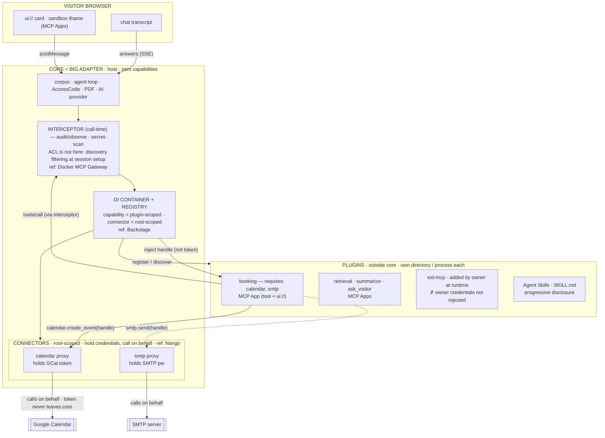

# StandMeet platform architecture (master design) — the big adapter: core has zero capabilities; capabilities / connectors / skills all live outside

> **Status:** In design (drafted 2026-06-18; promoted to the master design after the switch to the "replace" framing). Governs task #134 (MCP Apps) + #135 (registration/discovery) + all three orientations: host / connector / as-MCP-server.
> **Scope:** This is StandMeet's **master architecture design**. It settles, in one place, the two kinds of things the "big adapter" sits between (inward capabilities / outward connectors), the three orientations, the two cross-cutting controllers (permissions and observation), and where every admin surface belongs. The implementation breakdown is in [`platform-architecture-tests.md`](platform-architecture-tests.md).
> **Readers:** The people who will actually build this. You are assumed to have read `CLAUDE.md` and the three MCP spec pages on lifecycle / tools / transports.
> **How to give feedback:** Each block ends with numbered decision points (`P.1`, `P.2`…). Reply `Pₙ: accept` or `Pₙ: change — <reason>`. Anything not mentioned counts as accept.

---

## TL;DR — in one sentence

**This is a replacement, not coexistence.** End state:

- **core = corpus + visitor chat + AccessCode + PDF + AI provider + one plugin loader. Zero capabilities.** The existing `MustRegister` (agentskills built-in capabilities) + the in-process `plugins.Registry` (the job-loop one) are **deleted entirely**.
- **Every capability + every skill (retrieval / booking / email / skill-runner / ext-mcp / job-loop …) moves out into its own directory**, and each one is a **standard MCP server**. Not in the main backend, not in the main frontend.
- **When docker-compose comes up, each one is loaded into core as a builtin MCP/skill** (registered at boot, not compiled in). "builtin" = the default plugin set shipped with the product, loaded at compose time — architecturally it still sits outside core. The owner can add their own at runtime too (the ext-mcp path).
- The frontend works the same way: capability UI cards are not hard-coded; they go through MCP Apps (`ui://`), and each plugin ships its own.

The mechanism copies the **MCP protocol** exactly: declaration (manifest) → discovery (dial + `tools/list`) → invocation (`tools/call`), with transport over MCP's two standard pipes (stdio / Streamable HTTP).

---

## Architecture overview

StandMeet = one **big adapter**, sitting between two kinds of things: inward capabilities (MCP Apps) ↔ outward credentialed connectors (Nango-proxy). Each layer is labelled with the open-source reference it borrows from.


```mermaid
flowchart TB
  subgraph BROWSER["VISITOR BROWSER"]
    chat["chat transcript"]
    card["ui:// card · sandbox iframe (MCP Apps)"]
  end

  subgraph CORE["CORE = BIG ADAPTER · host · zero capabilities"]
    direction TB
    loop["corpus · agent loop · AccessCode · PDF · AI provider"]
    icpt["INTERCEPTOR (call-time) — audit/observe · secret-scan<br/>ACL is not here: discovery filtering at session setup<br/>ref: Docker MCP Gateway"]
    di["DI CONTAINER + REGISTRY<br/>capability = plugin-scoped · connector = root-scoped<br/>ref: Backstage"]
    subgraph CONN["CONNECTORS · root-scoped · hold credentials, call on behalf · ref: Nango"]
      cal["calendar proxy<br/>holds GCal token"]
      smtpc["smtp proxy<br/>holds SMTP pw"]
    end
    loop --> icpt --> di --> CONN
  end

  subgraph PLUGINS["PLUGINS · outside core · own directory / process each"]
    direction TB
    booking["booking — requires: calendar, smtp<br/>MCP App (tool + ui://)"]
    others["retrieval · summarize · ask_visitor<br/>MCP Apps"]
    extmcp["ext-mcp · added by owner at runtime<br/>✗ owner credentials not injected"]
    skills["Agent Skills · SKILL.md<br/>progressive disclosure"]
  end

  GOOGLE[["Google Calendar"]]
  SMTPSRV[["SMTP server"]]

  chat -- "answers (SSE)" --> loop
  card -- "postMessage" --> loop
  di -- "register / discover" --> PLUGINS
  di -- "inject handle (not token)" --> booking
  booking -- "tools/call (via interceptor)" --> icpt
  booking -- "calendar.create_event(handle)" --> cal
  booking -. "smtp.send(handle)" .-> smtpc
  cal -- "calls on behalf · token never leaves core" --> GOOGLE
  smtpc -- "calls on behalf" --> SMTPSRV
```

The flow of one booking call (① → ⑨):

```mermaid
sequenceDiagram
  autonumber
  participant V as Visitor (code)
  participant Core as CORE (agent loop)
  participant I as Interceptor
  participant DI as DI container
  participant B as booking plugin
  participant Cal as calendar connector
  participant G as Google

  V->>Core: asks a question
  Note over Core: calendar.book is already in the frozen spec<br/>(visitor ACL is decided at session setup; without a grant it is not in the spec at all)
  Core->>I: tools/call calendar.book
  Note over I: observe/audit + secret-scan (call-time)
  I->>B: tools/call
  B->>DI: requires: calendar?
  Note over DI: ✔ plugin-level dependency resolution → inject handle
  DI-->>B: calendar handle (not token)
  B->>Cal: calendar.create_event(handle)
  Cal->>G: decrypt owner token · call on behalf
  Note over Cal,G: booking never touches the token
  G-->>Cal: event created
  Cal-->>B: result
  B-->>Core: tool result + ui://booking-card
  Core-->>V: render card into chat (iframe)
```

| Layer | What it is | Reference |
|---|---|---|
| Capability (inward, no secrets) | MCP App (plugin-scoped plugin) | MCP Apps |
| Connector (outward, holds secrets, calls on behalf) | root-scoped proxy service | Nango |
| Host wiring (capability ← connector) | DI container + scope | Backstage |
| Call-time checkpoint (audit · observe / leak prevention; **ACL is not here — it is discovery filtering at session setup, see P.11**) | interceptor middleware | Docker MCP Gateway |
| Capability ↔ credential separation | piece ↔ connection | Activepieces |

---

## StandMeet's three orientations (full map of outward / inward relationships)

StandMeet plays three roles at once. Each has a different credential direction. Do not mix them up:

| Role | StandMeet is | Counterpart | Credential direction |
|---|---|---|---|
| **host (big adapter)** | MCP client / host | capability plugins (MCP App) | — |
| **connector-owner (reaching out)** | secret-holding caller | Google / SMTP / Obsidian | holds **someone else's** secret, authenticates **outward** |
| **MCP server (inverted)** | MCP **server** | owner's Claude Desktop / Cursor / Claude Code | owner holds a **key issued by StandMeet**, authenticates **inward** |

**The third one (as-MCP-server) is an aggregating facade**: it gathers every plugin's owner-facing tools (each `OwnerMCPBindings`) into **one MCP endpoint** for the owner's off-site host. It is the **same gateway pattern** as the visitor side (Docker MCP Gateway / ContextForge); only the consumer differs:
- **Visitor side**: aggregate plugin tools → on-site agent loop (the visitor's AI).
- **Owner side (inverted)**: aggregate plugin owner tools → off-site host (the owner's Claude Desktop).

Once everything is a plugin, this **benefits automatically**: each plugin declares its own owner-facing tools, the facade aggregates them into the outward endpoint, and core hard-codes nothing. Already exists: owner-MCP + keypair signing + the `@standmeet/mcp-client` SDK (the `c3-mcp-client-stdio` spec).

**Decision point P.10: StandMeet has three orientations (host / connector-owner / as-MCP-server). as-MCP-server is the registry's outward face; it aggregates plugin owner tools into a single endpoint; it is the same gateway pattern as the visitor side.** *(Landed / #143: `mcphandle.registerTools` only walks `reg.OwnerMCPBindings()` — core owner capabilities + plugin owner tools are aggregated together, core hard-codes no tool list; the old `tools_*.go` AddTool calls are all deleted.)*

### Entry-agnostic: the agent is neutral, the two sides are symmetric

**Both kinds of things core sits between (inward capabilities / outward connectors) are transparent to "who invokes the agent".** Entries / orchestration are only
**consumers**: each one fills in a **session context** and invokes the agent; the agent does not know, and should not know, who invoked it:

| Role | The only thing it knows | The seam it gets | What it does not know |
|---|---|---|---|
| **Entry / orchestration** (consumer) | the events it received | — fills session context, invokes the agent | capability/connector internals |
| web visitor (code/BYOAI/gate) · **IM Gateway (future)** · **job-loop outbound (future)** | | | |
| **agent loop** (neutral core) | it has tools, it has a session context | — | who the entry is |
| **inward: capability (MCP App)** | "it was used by the agent" | `_meta.standmeet/session` (neutral session context: owner_id / conversation_id / corpus scope …) | whether the entry is web or IM |
| **outward: connector** | "it was resolved by name" | handle (an ownerID call port, no credential getter) | who is using it (D-8) |

The two seams are **symmetric**: capability ↔ session context; connector ↔ handle. Both are transparent to the entry — so when the IM Gateway /
job-loop plugs in, **capabilities and connectors do not change by a single line**; there is just one more consumer filling in a session context.

> The v1 implementation vocabulary is "visitor" (single web entry). That is the only consumer today, not a model limit. The neutral `_meta.standmeet/
> session` sidechannel is the carrier prepared for "swap/add entries later" — the booker comment "per-visitor
> identity rides `_meta`" describes the mechanism, and the mechanism itself is entry-agnostic.

**Decision point P.12: the agent is entry-agnostic; inward/outward are symmetric.** Entries/orchestration are consumers (they fill session context and
invoke the agent); a capability only knows "it was used by the agent" (it consumes a neutral session context); a connector only knows "it was resolved by name" (D-8).
A new entry (IM Gateway / job-loop) = a new consumer; capabilities and connectors stay unchanged. The as-MCP facade and "IM Gateway as a consumer"
are essentially the same kind of thing (both expose the agent/capabilities to an external orchestrator). Consider unifying them at implementation time; do not build two of them.

### agent core = an independently launchable module (Bridge / Driver)

P.12 says "the agent is neutral; the entry is just a consumer". Its **structural implementation** is: **core is a module that can be launched on its own and exposes
one handle, `Launch(Driver, input) → transcript`**; prod and eval (used for trying prompts) both launch through the **same**
handle, each plugging in its own **Driver**. This is both the concrete form of entry-agnosticism and the mechanism for "finding a good prompt": launching the agent
on its own and injecting different prompts in parallel across processes works precisely because "eval is just another consumer".

**Driver = the bridge (the Implementor in the Bridge pattern).** The few **external side effects + data** that change with the environment
(running scripts / calendar book·freebusy / sending mail / LLM resolve / fetching corpus·conversations) are extracted into **one narrow interface that core
defines itself**. Every method signature **uses only agentcore's own public DTOs** (`CorpusEntry`/`BookReq`/`SkillIO`/`Cred`…),
with **zero `internal/` leakage**.

> **Iron rule: re-export ≠ independence; re-export = dependency.** Pasting `internal/`'s `VisitorSkillsDeps`/`domain.Wiki`
> as aliases for an external module only renames "depends on backend internals" — the caller still knows that pile of internal types,
> and is still coupled. **The Driver is a contract core defines for itself**; prod / eval each write a ConcreteImplementor and plug it in;
> the driver depends on **core's stable interface**, not on internal — just as a device driver implements the OS driver API and the OS does not know
> the concrete hardware. **That is what independence means.**

```
  module: eval-harness (own go.mod)           module: backend · cmd/server
  ┌────────────────────────┐                  ┌────────────────────────┐
  │  EvalDriver «concrete» │                  │  ProdDriver «concrete» │
  │  RunSkill→canned stdout│                  │  RunSkill→real sandbox │
  │  Book→fake/inject fail │                  │  Book→real GCal        │
  │  Resolve→.env key      │ all canned here  │  Corpus→postgres       │  real system
  └───────────┬────────────┘                  └───────────┬────────────┘
              ┊ implements                                 ┊ implements
              ▽         both: Launch(driver, input)        ▽
  ┌─── backend · package agentcore (public · independently launchable) ─┐
  │   «Implementor» Driver (narrow interface, all public DTOs, zero      │
  │                         internal leakage)                            │
  │        △ uses                                                       │
  │   «Abstraction» Launch(d Driver, in Input) → transcript ← launch handle│
  │        │ 1) d.Corpus()/RunSkill()… fetch side effects + data         │
  │        ▽ 2) bridgeAdapter: public DTO ⇆ internal deps (shared by    │
  │   ┌──────────────────────────────────────────────┐  prod/eval,      │
  │   │ bridgeAdapter → internal/capreg (real wiring) +│  not a fixture!) │
  │   │                 internal/inference (runs loop) │                 │
  │   └──────────────────────────────────────────────┘                 │
  └────────────────────────────────────────────────────────────────────┘
   internal/* — core, never imported by an external module; the driver only knows agentcore.Driver
```

**Invariants**: ① The Driver interface + DTOs are all agentcore public types → eval-harness implements it with **zero imports
of `internal/`**. ② **All canned data lives in EvalDriver (inside eval-harness); the backend has not a single fixture.**
③ `bridgeAdapter` (the Driver→capreg translation) lives in the backend and is **shared** by prod and eval; it is a **real adapter, not a
mock**. ④ The Driver's side-effect surface is exactly the few external boundaries of the connectors (sandbox/calendar/mail) — on the same line as
D-8 "connector = consumer-agnostic foundation".

> Current deviation (to fix): today `backend/agentcore/*_fixture.go` has `cannedSandbox`/`skillFixture` etc.
> **welded into the backend**; eval does not plug in a driver, instead core assembles fixtures internally on the spot — this violates ②. The fix = extract the `Driver` interface,
> move canned data to eval-harness, keep only `bridgeAdapter` in the backend.

**Decision point P.13: agent core is an independently launchable module; the environment is injected through Bridge/Driver.** core exposes
`Launch(Driver, input)`; prod / eval each implement `agentcore.Driver` (narrow interface, all public DTOs, zero
internal leakage). **Re-exporting internal types = dependency, forbidden**; canned data may only live with the caller (eval-harness), and the backend has
zero fixtures. The Driver side-effect surface = the connectors' external boundaries (unified with D-8).

---

## Full coverage (tests are the source of truth) — where the 26 admin surfaces belong

We audited every admin section + 225 e2e specs (see the audit for details). Every surface has a home; none is left homeless:

| Bucket | surfaces | What it is in this architecture |
|---|---|---|
| **Capability (A)** | (booking/retrieval etc., not admin sections) | → MCP App plugin (registration-based) |
| **Authored artifact (A2)** | prompts · skills · agent-skills | → content library (prompt + skill are one family: CRUD/marketplace/attach to role); skills go through Agent Skills + skill runtime |
| **Connector (B)** | connectors (calendar/mail) · obsidian · sources | → connector layer (action / sync) |
| **Corpus (C)** | raw · wiki · output · writings · seo | → core data (owner content store + curation) |
| **as-MCP-server (D)** | api-mcp · keypair | → outward facade (the owner's Claude Desktop connects in) |
| **Permission controller (E)** | roles · codes · prompts · ip-bans/security | → host cross-cutting controller #1 (ACL, **discovery/assembly filtering at session setup**, not call-time interception) |
| **Observer (F)** | **System observability**: system (version/resources/jobs/health/metrics) · activity-ticker; **Conversation observation (product side)**: conversations · dashboard · requests · preview · ghost logs | → host cross-cutting controller #2 = **system observability → admin/system (#101)**; conversation observation belongs to the product/content side and is **not** a host controller |
| **Page hosting (G)** | page · microsites · preview | → SDK + sandboxed page hosting |
| **outbound/job (H)** | applications · drafts · listings · sources | → job-loop plugin |
| **Account (I)** | account · security | → account/auth |

### Two cross-cutting controllers — different timing and mechanism; do not merge them into one inline interceptor layer
The host has two cross-cutting controllers, but their **timing and mechanism are completely different**. They are **not** the Docker MCP Gateway kind of "every call passes the same inline middleware":

- **Permission controller (ACL) — acts at session setup; the mechanism is "not discovered", not "intercepted".**
  When a session/code is set up, the role snapshot is frozen (`RoleSnapshot` / `AllowedTools` / corpus_uris / mcp_server_ids). When visitor tools are assembled (`AssembleVisitor` / `VisitorToolSpecs`), an ungranted plugin tool returns `ErrHidden` directly — **it never enters this session's tool spec at all**, and the visitor's AI never sees it. So there is **no per-call second check**: the decision happens once, at the **session boundary**. roles (prompt + corpus glob + skills + mcp_servers) + codes (quota + assumed_role) + ip-bans. **Complete, with solid tests** (`iam-role-*` / `admin-codes-*` / `admin-ip-bans`).
  (Note: at call time there is also a **plugin-level** dependency resolution — `requires: calendar` → inject a connector handle; that is DI/connector dependency resolution, not visitor ACL.)
- **Observer — acts at call time; it is the system observability surface (→ admin/system).** Every plugin call that passes through emits telemetry (who, what was called, volume/latency/health) → feeds **admin/system** (version/resources/background jobs/health/metrics; #101 is still hard-coded today, with a fake-OK health) + the activity-ticker live stream. Once everything is a plugin this benefits automatically: it observes this layer, regardless of which plugin a tool comes from. **To do**: wire admin/system to a real backend + the activity-ticker live stream (currently a placeholder).
- **secret-scan** — call-time leak prevention, on the same side as the observer (a true inline middleware).

→ Only **observer + secret-scan** are the Docker MCP Gateway-style call-time inline trio; **ACL is not** — it is discovery/assembly filtering at session setup, deciding which plugin tools get into this session's frozen spec.

> **Keep these apart**: conversation transcripts (ghost logs / tool calls / citations) and dashboard KPIs are **product/content-side** reads of "what happened in a conversation". They are **not** the host observer controller; nor are they the deprecated observe-and-distill distillation engine (`observer-deprecated`, a dead direction: it does not touch the corpus, does not distil, does not write content).

### Ambiguous bucket assignments (Z, noted, not blocking)
- **seo** — settings + monitoring mixed in one section; it can be split (settings go to account, indexing stats go to the observer/system surface).
- **sources / listings** — read-only in admin, lifecycle lives in MCP (the job-loop plugin) — asymmetric; either add admin CRUD, or state explicitly that they are "MCP-owned".

**Decision point P.11: the host has two cross-cutting controllers with different timing and mechanism — ① the permission controller (ACL) acts at session setup, and its mechanism is "not discovered" (`ErrHidden`, never enters the frozen spec), not call-time interception; ② the observer acts at call time and is the system observability surface (→ admin/system, #101) + the activity-ticker live stream. Only the observer + secret-scan are call-time inline middleware; ACL is not. Conversation observation such as conversations/dashboard belongs to the product/content side, not to the host observer. The Z items (seo/sources/listings) are recorded as placement ambiguities and do not block the main line.**

---

## Why this is feasible — established facts + what gets deleted

1. **`agentskills.Capability` is the only seam.** Everything downstream (`AssembleVisitor` / `VisitorToolSpecs` / system prompt / owner MCP) only walks `Registry.List()`. Capabilities are registered **from the loader**, and downstream does not change by a single line.
2. **`ext-mcp` is a live template (and it is already standard).** What `agentskills_ext_mcp.go` does is: dial an external MCP server → `ListTools` → wrap each tool as a `BindingTool`. That is exactly MCP's `tools/list`. It is the "owner runtime" side, already standard, **kept and generalised**.
3. **What gets deleted (the target of the replacement):** ① every `MustRegister(newXxxCapability(...))` built-in capability implementation in agentskills, moved out into independent MCP servers; ② the in-process `internal/plugins` (`Plugin`/`CapabilityRegistrar`, used by job-loop) — a non-ideal ad-hoc pattern, deleted once job-loop has also moved to a standard MCP plugin.
4. **The gaps are precise.** Missing: manifest, loader (discovery source), the `_meta` bag, version negotiation, **Go-side stdio transport** (the existing stdio is the JS SDK in the opposite direction).

---

## The design MCP gives us (we copy it, we do not invent)

**Registration/discovery — three separate stages** (the lifecycle + tools pages):

| MCP | Meaning | Our counterpart |
|---|---|---|
| capability negotiation (`initialize`) | declares "which **categories** I have" + sub-capabilities (`listChanged`/`subscribe`), versioned, can be refused | **`PluginManifest`**: id / version / shape / transport / ui? |
| `tools/list` (with cursor) | pull the concrete list at runtime | dial transport → ListTools (generalised ext-mcp) |
| `notifications/tools/list_changed` | server pushes "the list changed" | (v2) install/uninstall triggers rediscovery |
| `_meta["ui/resourceUri"]` | UI does not fork the protocol; it hangs off metadata | manifest `ui{resourceUri,mimeType}` → `CapabilityState.Extra` (#134) |

**Transport — the two pipes fixed by the protocol** (the transports page, JSON-RPC over:):

- **stdio**: core **launches the plugin as a child process** and talks over stdin/stdout (newline-delimited; stdout may only carry MCP messages). The protocol says "prefer stdio where possible". **We do not have it yet.**
- **Streamable HTTP**: the plugin runs as an **independent service**, single endpoint, POST upstream / GET+SSE downstream, the `Mcp-Session-Id` header manages the session. **`mcpclient.Dial` already implements it.**

→ Plugin manifest = **our version of the MCP server config**: each entry is either `{command,args,env}` (stdio) or `{url,headers}` (http). Adding an entry to this config when deploying with docker = installing a plugin.

**Decision point P.1: copy MCP, do not invent a private protocol.** Support both transports (http reuses mcpclient, stdio is new), and each plugin declares which one it uses in its manifest.

---

## Two standards, not one: MCP ≠ Skill

What gets externalised falls into two kinds, which follow **two different open standards**. The loader must recognise two plugin kinds:

| | MCP capability | Skill |
|---|---|---|
| Standard | **MCP** (wire protocol, client↔server JSON-RPC) | **Anthropic Agent Skills** (folder + `SKILL.md`) |
| Form | a running server, `tools/call` at runtime | a directory: `SKILL.md` (YAML frontmatter: name+description) + body instructions + bundled scripts/resources |
| Loading | dial + `tools/list` | progressive disclosure: at startup read only name/description, read the body when relevant, then read attachments on demand |
| Who it is | booking / retrieval / ext-mcp / job-loop | owner-curated skills (the scripts that `skill.runner` runs today) |

→ booking/retrieval and the like = standard **MCP servers**; owner skills = standard **Agent Skills**. Both move out of core, but with **two mechanisms**. The existing `skill.runner` (runs owner scripts in a sandbox) is rewritten in the Agent Skills format.

**Decision point P.1b: MCP capabilities go through MCP servers; skills go through Agent Skills (SKILL.md); the loader handles the two kinds separately.**

### "Plugging in" a skill ≠ MCP registration — it belongs to the same family as prompts
A skill is not a running server. It is a **content artifact** the owner **authors / installs from the marketplace** (SKILL.md: instructions + optional scripts). It is managed **exactly like a prompt**:

| | MCP capability | **skill** | prompt |
|---|---|---|---|
| What it is | a running server | a SKILL.md folder | a piece of persona text |
| Plugging in | register / dial the server | **author in the library / install from marketplace** | write in the library |
| Loading | tools/list + tools/call | progressive disclosure + run scripts in sandbox | spliced into the system prompt |
| Management | registry | **content library + CRUD + attach to role** | **content library + CRUD + attach to role** |

→ **skill + prompt = the "authored artifact" family**: an owner-managed content library, CRUD, attach to role, fed into the AI context. That is a different thing from "register a running MCP server". The "one management system" the owner wants = **skills reuse the prompt management paradigm** (`PromptsSection` is a ready template). The material exists today but is scattered: `AgentSkillsSection` (installed + marketplace) + `SkillsSection` (persona skills CRUD) + `PromptsSection` — these need to be organised into **two equivalent management surfaces** for skills and prompts.

→ So the host has **two loading mechanisms**; do not mix them: ① MCP capability = dial server → route tools/call (registration-based); ② skill = fetch SKILL.md from the content library → progressive disclosure into the context + **skill runtime** (runs bundled scripts in a sandbox). The standard is Agent Skills; the management surface is our own (aligned with prompt management).

**Decision point P.1d: skills belong to the "authored artifact family" (same family as prompts); they are not MCP capabilities. Skills reuse the prompt management paradigm (library / CRUD / marketplace install / attach to role); the standard is Agent Skills (SKILL.md); the host provides the skill runtime (progressive disclosure + sandbox).**

### Skill mechanism design — copy Agent Skills; today it is already ~90% there
The current `skills` table (`name · description · prompt · scripts · allowed_tools · enabled · is_builtin`) + marketplace (`skillsmp.go`) + role_skills + CRUD (`SkillsSection`) — **the fields map almost 1:1 to Agent Skills**, and the management surface/marketplace/enable/attach to role **all already exist**.

| Agent Skills | Today | Action |
|---|---|---|
| SKILL.md (name + description + body + bundled scripts) | DB row | serialise / import as SKILL.md (the DB stays the management store; render to SKILL.md to feed the runtime) |
| `license` (optional frontmatter) | — | add one field |
| **progressive disclosure**: L1 name+description always in the system prompt → L2 read the body when triggered → L3 scripts run on demand in bash/sandbox (script code never enters the context, only the output comes back) | **eager**: every script becomes an LLM tool `skill_<name>_<script>` directly; the body goes through the persona channel | **the only real change**: switch to three-level progressive loading |
| name ≤64 kebab, description ≤1024, no XML/`anthropic`/`claude` | no constraints | add validation |

**Target loading model (faithful Agent Skills)**: L1 injects the `name+description` of every skill the role grants and that is enabled into the system prompt; when the agent judges one relevant → it reads the body back through a `use_skill(name)` tool (L2); scripts referenced by the body run on demand through the existing `sandbox.Runner`, returning only output (L3). This **replaces** "every script pre-exposed as a tool".

References: [anthropics/skills](https://github.com/anthropics/skills) (SKILL.md format + real examples), Claude Code's directory-based skill loading.

**Decision point P.1e: skill = managed in the DB + rendered to standard SKILL.md + three-level progressive disclosure loading (replacing eager tool-per-script). Format/marketplace/enable/attach to role already exist; only SKILL.md serialisation + progressive loading + field validation need adding.**

---

## No capability may be lost — the feature floor after externalisation

Externalisation = changing the carrier; **not a single feature may be lost**. Below is the floor locked by tests; after externalisation every item must still hold (the parentheses name the spec that locks it). **Key point: most of this gating/state is StandMeet-specific and does not exist in standard MCP/Skill → it stays in core as "plugin host" duty; plugins only provide tools/instructions, and core wraps this framework around the tools plugins produce.**

**retrieval → MCP server**: 3 tools (corpus_search/read/list); ACL gated on role.corpus_uris; empty corpus → `enabled=false` but **still visible** (a degraded hint, not disappearance); contributes a system-prompt fragment + enters part_ids + affects the hash. (`retrieval-block-state` / `session-block-bundle`)

**booking → MCP server**: 2 tools (calendar_book + calendar_list_slots, read-only and not counted against quota); the full gating chain — mode=code only (public/byoai never see it, `chat-book-public/byoai-denied`), role ACL (`chat-book-skill-not-granted`), **connector dependency** (GCal not connected/OAuth not finished → hidden, `chat-book-not-connected`), **quota** (max_bookings exhausted → the tool disappears rather than erroring + quota_remaining + live recompute across tools, `chat-book-quota-exhausted` / `tool-endpoint-state-cascade`), booking policy (conflict/busy/leadtime/weekend/hours, four `chat-book-conflict-policy-*`), token refresh (`chat-book-token-refresh`), notify the owner when booked (`booking-owner-notify`), session email default (`chat-book-session-email-default`), schema rejects partial args (`chat-book-schema-rejects-partial`), visitor cancels their own booking (`visitor-cancel-booking` / `tool-calendar-cancel-booking`).

**email (confirmation letter) → deterministic flow (not an AI tool)**: **SMTP connector dependency** (not connected → the card does not render the email section, `booking-confirmation-email` no-connector); HTML + schema.org EventReservation; recipient hard control (reference the session email / pass through / validate, invalid → 422 / skip).

**skill → Agent Skill**: owner scripts + allowed_tools; ACL (role grant); `skill.runner` enabled when the role includes a skill; tool_specs contain tool_<skill>_*; sandboxed execution. (`tool-endpoint-skill` / `b3-bundle-blocks`)

**ext-mcp → MCP server (owner-runtime source, already standard)**: dial→list→`ext_<server>_<tool>`; ACL via role.mcp_server_ids; unreachable → silently hidden (ErrHidden); **Close hook releases the session** (dial/close counts reconcile); encrypted auth header. (`tool-endpoint-ext-mcp` / `external-mcp-tools` / `b3-bundle-blocks`)

**job-loop → MCP server (owner-only)**: register_source / fetch_new / resume.draft / applications.commit + auto-issue AccessCode. (`integration-job-loop`)

**summarize / ask_visitor → MCP server**: summarize produces an HTML report stored in chat_reports + PDF; ask_visitor is deps-less + ReturnDirectly ends the loop. (`visitor-summarize-conversation` / `visitor-ask-visitor`)

### The cross-cutting framework the host must keep providing (standard MCP/Skill lacks it; core keeps it)
`capability_state` (live recompute per session + in every tool response), `enabled=false but visible` (degraded), system-prompt fragment + part_ids + hash, ACL (role.AllowedTools / corpus_uris / mcp_server_ids), quota, connector dependency gate, Close-hook lifecycle, ErrHidden (clean hide vs error), mode gating (code/public/byoai).

**Decision point P.1c: core is the "plugin host" — all of the cross-cutting gating/state above stays in core and wraps the tools plugins produce; externalisation must not cut a single item of the feature floor. Each item has an existing spec guarding against regression.**

---

## Enhancement: in-app dependency resolution and injection (the key to "enhanced MCP")

Standard MCP discovery (initialize / tools/list / transports) is **not enough** — it does not know that the booking plugin needs the owner to have connected Google Calendar, or that the email plugin needs SMTP. Our registration/discovery mechanism must be **enhanced**: a plugin can **declare which in-app resources it depends on**, and the host is responsible for **resolving + injecting** them.

### 1. Host dependency provider registry (host dependency providers)
core holds a set of **named in-app dependencies**; each one is backed by a connector + credential store + lifecycle:

| Name | Backed by | owner-facing |
|---|---|---|
| `calendar` | GCal connector (OAuth token) | admin connectors page |
| `smtp` | mail connector | admin connectors page |
| (later, `corpus` / `accesscode` / `ai-provider` etc. can also be exposed as named dependencies) | | |

The connector's **connect / OAuth / storage / admin UI all stay in core** (owner-facing lifecycle, which belonged to core anyway).

### 2. manifest `Requires: []string`
A plugin declares which named dependencies it needs: booking → `Requires: ["calendar"]`, email → `Requires: ["smtp"]`.

### 3. Boot validation (fail fast)
At load time every `Requires` name must be a **known provider** → otherwise registration is refused + logged (same nature as the version gate: if core cannot provide what the plugin needs, the plugin does not go live).

### 4. Per-session resolution + injection of a "handle", not credentials (the Nango proxy model)
When a visitor session assembles a plugin, for each `Requires`:
- **Resolve the owner instance: not connected → the plugin is hidden/degraded** (this is the connector gating of booking/email in the feature floor, unified at this layer instead of hard-coded in the booker).
- **Connected → inject a "service handle", not credentials**: the connector is a root-scoped **Nango-style proxy** service with the owner's token locked inside it. The plugin gets a `calendar` call handle routed through the host and calls `calendar.create_event(...)`; **credentials never enter the plugin at any point**.

→ This way **booking's Google integration logic moves into the booking plugin, but the owner token never leaves core**. Booking is "hard" precisely because it hangs off a connector — enhanced dependency resolution is the carrier prepared for it (and for email).

### 5. Two connector modes: action (proxy) / sync (ingest)
Every connector is "a hand the host extends outward, carrying credentials", but there are two directions (= Nango's two primitives):

| Mode | Data direction | Trigger | Examples | Nango primitive |
|---|---|---|---|---|
| **action** | capability → external (doing things outward) | called on demand by a capability during visitor chat | calendar / smtp | Proxy |
| **sync / ingest** | external → corpus (pouring content inward) | background / scheduled, unrelated to any particular chat | Obsidian / Notion sync | Sync (Functions) |

Same connector abstraction (same provider declaration + same encrypted credential vault), just a different mode. **Obsidian is not a new third kind; it is a sync-mode connector**: it attaches at the ingest edge (`vault → corpus`), then the `retrieval` capability serves visitors from it; it **never enters the visitor's call chain**.

### 6. connector = a consumer-agnostic, bidirectional foundation (D-8)
Connectors do not serve only MCP. "Resolve a connector by name + get a handle" sits in a **neutral place** (`connector.Hub`, which **does not import
MCP packages**), so any consumer can use it:
- **MCP capabilities** (gated through dependency resolution) are "one of the consumers" — this is what exists now.
- **IM Gateway (future)** is another: the owner is @-mentioned in Discord/Slack → the Gateway invokes the agent → the agent uses that IM
  connector's credentials to **read channel history** (read) into context, then uses the same credentials to **send a message** (write) back to the channel. **It never touches
  MCP / the visitor session / mcp-ui:tool at any point**.
- **job-loop outbound (future)** is one too: it uses connectors directly to send confirmation letters / schedule.

So the connector handle must be **bidirectional** (read+write, not just action's `Send`), and its base surface has no credential getter. At implementation time, merge
`capreg.DepRegistry` into `connector.Hub` (one foundation, many consumers; do not build one per consumer). The guard test
`connector.TestConnector_ConsumerAgnostic_BidirectionalGateway` (fakeGateway does not import capreg =
compile-time proof) locks this red line.

**Security**: owner credentials **never enter a plugin** (the Nango proxy holds the secret and calls on behalf; the plugin only gets a call handle routed through the host). An ext-mcp added by the owner at runtime **does not even get a handle** (it is the owner's own external server, the lowest trust; it needs explicit owner authorisation before it is wired to a dep).

**Decision point P.9: enhancement = standard MCP discovery + dependency resolution. The manifest `Requires` declares named in-app dependencies; connector = root-scoped Nango-style proxy (holds the secret, calls on behalf); what gets injected into a plugin is "a call handle, not credentials"; per session, not connected means gated; ext-mcp is not wired to deps by default and needs owner authorisation. Connectors have two modes, action / sync, under one abstraction; Obsidian = sync.**

---

## Design — three new building blocks + one generalisation

### 1. `PluginManifest` (declaration)
```
type PluginManifest struct {
    ID        string            // → Capability.ID(), unique
    Version   string            // protocol/schema version; core refuses it if incompatible
    Shape     agentskills.Shape // visitor_only / owner_only / both
    Transport PluginTransport   // stdio or http, one of the two
    UI        *PluginUI         // optional: {ResourceURI, MimeType} (#134)
    PromptFragmentID string     // optional: system prompt fragment id
}
type PluginTransport struct {
    Kind    string            // "stdio" | "http"
    Command string; Args []string; Env map[string]string  // stdio
    URL     string; Headers map[string]string             // http
}
```
Tools are not written in the manifest — like ext-mcp, they are fetched with `ListTools` at dial time (runtime discovery, single source of truth).

### 2. `PluginSource` (discovery source)
Reads the manifest list at boot. v1 source: a config file (JSON/TOML pointed to by `STANDMEET_PLUGINS`, shaped like Claude Desktop's `mcpServers`). Returns `[]PluginManifest`. **This is "no hard-coded list"** — the list comes from the deployment, not from code.

### 3. `pluginCapability` (generalised adapter)
Adapts `manifest + one transport-agnostic mcpclient.Session` to the existing `Capability` interface: `VisitorBinding` = dial transport → ListTools → wrap as BindingTools (**this is the ext-mcp body with the transport pulled out**), and `_meta.ui` goes into `CapabilityState.Extra`. This is what gets registered into the Registry, one per manifest.

### 4. Pull the transport out of mcpclient
Today `mcpclient.Dial(url, headers)` is welded to HTTP. Extract a `Transport` interface (reads and writes JSON-RPC frames); HTTP is one implementation, and **a new stdio implementation is added** (spawn a child process + stdin/stdout). `initialize/ListTools/CallTool` on top of `Session` stay unchanged.

**Decision point P.2: ext-mcp and capability plugins are unified on the same `pluginCapability`.** ext-mcp reduces to "a plugin from the owner-runtime source", and capability plugins are "plugins from the deployer-install source" — same adapter, only the `PluginSource` differs. (Migration is left for later; they coexist first.)

### 5. `Origin` — how built-ins are told apart from plugins
Origin is **a fact at registration time**, not a property of the capability itself → it lives in the Registry and does not pollute the `Capability` interface. Three origins map to three trust levels:

| Origin | Source | Trust level | Registration entry |
|---|---|---|---|
| `builtin` | compiled into the binary | core level (highest) | `MustRegister` (default, unchanged) |
| `managed` | deployer install config (PluginSource) | install level | `RegisterDiscoveredPlugins` |
| `owner` | external server the owner fills in at runtime (ext-mcp) | owner level (lowest) | owner-sourced PluginSource |

Why they must be told apart: ① the three trust levels differ, and the P.4 boundary relies on it; ② provenance badges (admin / capability map show "built-in" vs "plugin:X"); ③ migration counting (`ListByOrigin(builtin)` counts how many built-ins are still not migrated); ④ shadowing protection (a plugin collides with a built-in ID → **the built-in wins** + refuse + log).

Implementation: the Registry stores `{cap, origin}` internally; `MustRegister` defaults to `builtin` (backward compatible); add a registration entry that takes an origin; `List()` unchanged, add `ListByOrigin`; `CapabilityState` gets an `origin` field passed through to the frontend badge.

**Decision point P.5: origin is a registration fact, stored in the Registry and not in the Capability interface; a built-in wins on a name collision.**

---

## Management plane — add / delete / enable / disable / ACL

Split the management of "capabilities" into **two orthogonal axes**. Key point: do not merge "exists" and "available" into one thing.

### Axis one: existence — who controls whether it "is there". **Decided by Origin.**

| Op | builtin | managed (install) | owner (runtime) |
|---|---|---|---|
| **add** | at compile time (code) | at install time (config file) | filled in by the owner in admin (exists: MCPServersPanel) |
| **delete** | ❌ cannot be deleted | ❌ not at runtime (change the config and restart) | ✅ deleted by the owner in admin (exists) |

Existence = a direct consequence of Origin. This is what you meant by "builtins cannot be deleted". owner-origin already has full CRUD (`use-mcp-servers.ts`); managed/builtin have no runtime delete entry — **the delete button lights up only for owner-origin**.

### Axis two: availability — whether the owner turns it "on for visitors". **Three gates, the same for every Origin.**

For a capability to actually be exposed to a visitor session, it must pass **all of these at once**:

1. **Owner enable / disable** — one toggle in admin. **This is new** — today there is no "manually switch off a working capability"; the only way is deleting. Owner switching off ≠ deleting (a builtin cannot be deleted but **can be switched off**). Stored in `capability_settings(owner_id, capability_id, enabled)`, default enabled.
2. **Connector dependencies met** — a capability declares which connector it needs; not connected → automatically hidden (greyed out + "connect Google Calendar first"). Today booking / email **hard-code this in code**; it must become **declarative + one unified gate**.
3. **Role ACL grant** — `role.AllowedTools` contains the capability id. **Exists today** (booking relies on it); plugin capability ids just go into the same list, and the roles admin UI extends naturally.

**Final exposure decision (unified, the same for built-ins / plugins):**
```
exposed = exists(origin) ∧ owner_enabled ∧ connector_deps_met ∧ role_acl_grants ∧ quota_ok
```
This **abstracts** the three gating layers booking hard-codes today (ACL + connector + quota) **into a general model** that plugins reuse directly — not a new invention, just generalising `bookerGatingClear`.

### How connector dependencies are declared
- **builtin**: declared in code (booking → `domain.CalendarProvider`, email → mail connector).
- **Plugin**: in the manifest, `Requires: ["calendar"]` / `["smtp"]`. Before exposing, `pluginCapability` checks these connectors' `Connected()` (generalising `bookerGatingClear`).
- → Connectors become a **named registry** that capabilities (code or manifest) reference by name. This is also why booking is "hard": it is not an independent tool, it **hangs off the owner's Google connector**; externalising it requires this dependency declaration mechanism first (so booking moves out last, and the dependency-free retrieval moves first).

### Admin "capabilities" panel
In the same area as connectors (or a new "capabilities" section), list **all** capabilities (builtin + managed + owner). Each row: origin badge, enable toggle, connector dependency status ("needs Google Calendar — not connected"), delete button (**lit only for owner-origin**). ACL is still managed in the roles section.

**Decision point P.6: existence (controlled by Origin) and availability (controlled by the owner plane: enable / connector / ACL) are orthogonal; do not mix them.**
**Decision point P.7: add a `capability_settings` table to store the owner's per-capability enable; default on; builtins can be switched off but not deleted.**
**Decision point P.8: connector dependencies are declarative — builtins declare them in code, plugins in the manifest `Requires`; connectors become a named registry; check `Connected()` uniformly before exposing, generalising `bookerGatingClear` into a general gate.**

---

## Step-by-step implementation (TDD: each step writes a failing test first, then goes to green)

> One commit cannot do it all. Each commit below is self-consistent, independently verifiable, and independently committable.

### C1 — manifest types + config source + version gate
- Write `PluginManifest` / `PluginTransport` / `PluginUI`; `PluginSource` reads the config file → `[]PluginManifest`; incompatible version → skip + log.
- **Tests (unit, testify, zero ifs):** parse a valid config; invalid JSON errors; incompatible version is refused; empty source → empty slice; both stdio/http transports are parsed.
- Not wired to the Registry; pure data layer.

### C2 — mcpclient stdio transport + transport abstraction
- Extract the `Transport` interface; move HTTP into it; write stdio from scratch (spawn / stdin / stdout / stderr goes to the log / process reaping).
- **Tests (integration):** a **real** minimal stdio MCP server (add one to mock-stack, a few dozen lines: initialize + tools/list returns one echo tool + tools/call); `mcpclient` dials it over stdio → ListTools gets echo → CallTool works. Run a regression on the HTTP path (existing ext-mcp e2e already covers it; run it once to confirm nothing broke).

### C3 — `pluginCapability` adapter (generalising ext-mcp)
- Extract ext-mcp's dial→list→wrap body into a transport-agnostic `pluginCapability`; ext-mcp becomes a thin shell over it (owner source).
- **Tests (integration):** feed `pluginCapability` a manifest (pointing at a mock plugin) → `VisitorBinding` produces a Binding containing that plugin's tool; `_meta.ui` goes into `CapabilityState.Extra`. Existing ext-mcp tests all green (proves the generalisation did not regress).

### C4 — boot discovery + wiring into the composition root
- `RegisterDiscoveredPlugins(reg, source)`; in wireup, `RegisterVisitorSkills` = built-ins (still there during migration) + discovered plugins.
- **Tests (e2e, browser-driven):** mock-stack brings up a stdio/http plugin server + a config file declaring it → a real visitor enters chat → the AI calls this tool that is **declared in config, not MustRegister** → the answer is correct. This is the end-to-end hard proof that "core discovered a capability it did not hard-code".

### C5 — move one built-in out (prove it can be externalised) *(later)*
- Rewrite retrieval (or booker) as a manifest plugin, proving built-ins can be externalised; the `MustRegister` list moves toward empty.
- **Tests:** that capability's existing e2e unchanged and all green (behaviour equivalent; only the registration source changes).

### C4.5 / #134 — per-tool `ui://` cards wired into chat *(landed)*
The MCP Apps protocol declares the ui resource on **each tool**'s `_meta.ui_resource` (not at manifest/capability level),
so a multi-tool capability can emit several cards. At assembly time the host reads the ui per tool (`resources/read`) and sends it down in
`tool_specs[].ui_html`; the frontend fetches it by exact tool name and renders it into a sandbox iframe (`sandbox="allow-scripts"`).

postMessage protocol (`use-mcp-app-card`):
- `mcp-ui:ready` → parent injects `{data:<tool result>, tool:<tool name>}` (the tool name lets one card serve several same-shaped tools)
- `mcp-ui:submit {value}` → parent `onAsk(value)` into the next turn (ask_visitor / slots chip)
- `mcp-ui:link {href}` → parent opens a window (the sandbox has no allow-popups; report "open as page")
- `mcp-ui:height` → auto height

**Migrated (plugin ships its own card, hard-coded card deleted):** `ask_visitor` (ask-visitor), `corpus_search`/`corpus_list`
(retrieval, one card serves two tools), `summarize_conversation` (summarize), `calendar_list_slots` (booker).

**Still hard-coded (`NON_SANDBOX_CARDS`):**
- `calendar_book` (the booked card) — cancel / sending the confirmation letter are **connector-backed mutations** triggered from the card;
  they belong to the connector refactor (the card goes external with it; that is where "how a sandbox sends a credentialed operation" ends up = `mcp-ui:tool` + connector).
- `skill_*`/`ext_*` (dump card) — the generic debug fallback for any "card-less" tool, not a card hard-coded per capability.

**Decision point P.3: during migration, built-ins and plugins coexist; do not flip everything at once.** First get the discovery mechanism running green alongside MustRegister, then migrate built-ins one by one, and finally empty the hard-coded list — the only hard-coded cards left now are booked (connector refactor) + dump (generic fallback), to be closed out as planned.

---

## Security / boundaries (protocol requirements + our additions)

- stdio: what core spawns is a **command configured by the deployer** (trust boundary = whoever can write that config file = whoever can deploy). stdout only accepts MCP messages; stderr goes to the log.
- http: the protocol requires validating `Origin`, binding only to 127.0.0.1 locally, and authentication. The owner-runtime source (ext-mcp) already has encrypted auth headers; the install source uses encrypted headers too.
- A plugin failure **does not block chat** (carried over from ext-mcp: dial/list/call failures are silently skipped or folded into an errJSON tool_result).
- A plugin with an incompatible version is **refused registration** (the local version of protocol version negotiation).

**Decision point P.4: trust boundary = deploy rights.** Being able to write the plugin config == being able to deploy == already root-level trust; core adds no extra plugin sandbox (isolation of stdio child processes is left to the container layer).

---

## Glossary

- **plugin** = one external MCP server + one manifest. From the install source or the owner-runtime source.
- **capability** = one entry in the Registry; a plugin adapted through `pluginCapability` is one capability. Built-in capabilities and plugin capabilities have equal standing in the Registry.
- Do not introduce parallel concepts such as `ExternalTool` / `Addon` — call them plugin / capability throughout.
