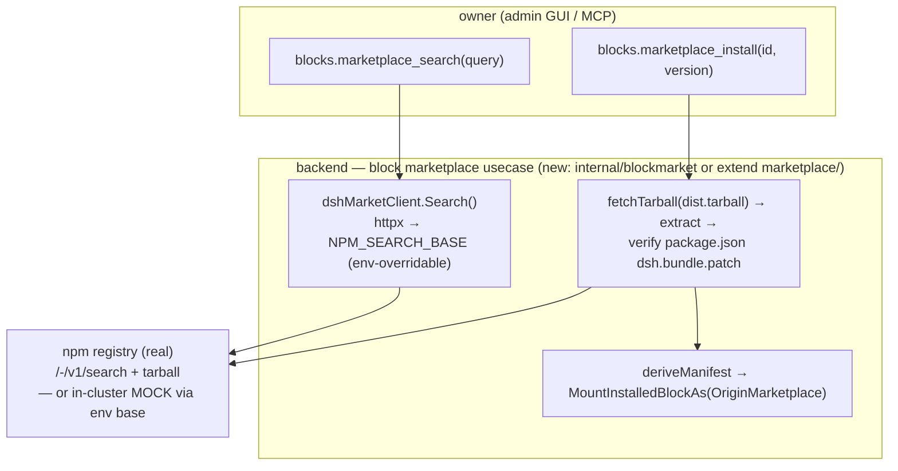

# dsh block marketplace — real npm-backed discovery + install (replaces the fake catalog)

> **Status: LANDED 2026-09-18.** Real npm-backed search + install shipped (`blockmarket.go`);
> the hardcoded `blockCatalog` / `install_fixture` stub (P.13, flagged by `check-no-mock`) is
> gone. Verified: `dsh-marketplace-install` 9/9 + `dsh-reciprocity` 3/3 + `norm-outward-toolset`
> 3/3 (hermetic, vs the in-cluster npm mock), and `dsh-market-live` 2/2 against **real npm**
> (`make test-dsh-live`). Full `make lint` green.
> **Goal:** the block marketplace is a real feature that piggybacks the actual dsh/npm
> plugin ecosystem, with a **default-skip integration test that truly connects to npm and
> passes**.

## Verified upstream (2026-09-18, live curl)

There is **no dsh-specific registry**. The dsh harness (deepseek-harness) uses plain **npm**:
- **Discovery** = npm search API, live: `GET https://registry.npmjs.org/-/v1/search?text=<q>&size=<n>`
  → `{ total, objects: [ { package: { name, version, description, keywords, links, author }, score, searchScore } ] }`.
- **dsh plugins are real on npm** under `@deepseek-ai/cordis-plugin-*` (confirmed: `-timer` 1.1.4,
  `-include`, `-group`); community plugins are `koishi-plugin-*` (confirmed: `koishi-plugin-base64` 1.0.0).
- **Install** = fetch `dist.tarball` (in the package doc) → extract → the package is a mountable
  dsh block iff its `package.json` declares **`dsh.bundle.patch`** (deepseek-harness
  `apps/desktop/src/project-manager.ts:305-319`). That field is **not** in npm's registry metadata
  (npm strips custom top-level keys) — it is only in the tarball, so install must fetch+extract to verify.

So **"蹭 dsh 的市场" = npm search on `@deepseek-ai/cordis-plugin` / `koishi-plugin-`**, gated on the
`dsh.bundle.patch` marker at install.

## Model it on the skills marketplace (the working precedent)

`backend/internal/marketplace/` already does exactly this shape for SKILLS — copy it:
- `usecase/client.go` — a `Client` with **env-overridable base URLs** (`MARKETPLACE_GITHUB_BASE_URL`,
  `MARKETPLACE_SKILLSMP_BASE_URL`): default = real upstream; e2e points at an in-cluster mock.
  Parallel sources, partial-result tolerance, TTL cache.
- `usecase/github.go` / `skillsmp.go` — one file per source: fetch upstream → map to `entity.MarketSkill`.
- `usecase/marketplace.go` ops — `marketplace.search` / `marketplace.install`, real network fetch.
- Uses `internal/infra/httpx` (the guarded client — the `no-raw-http` gate forbids raw `net/http`).

The env-overridable base is the **exact seam the skip-test needs**: default e2e drives a deterministic
in-cluster npm-search mock; the skip-gated test unsets the override and hits real npm.

## Architecture

## What changes (subtract the fake, add the real)

- **Delete** `cmd/server/blockwire/marketplace_blocks.go` (hardcoded `blockCatalog`) and the
  fixture-install path `fixture_install.go` (the `install_fixture` op + `dshecho`/`dshupper` canned
  manifests + `OriginFixture`). This clears the `check-no-mock` P.13 violation.
- **Add** a real dsh-market client (npm-search-backed) behind `blocks.marketplace_search`, and a real
  `blocks.marketplace_install` (fetch tarball → verify `dsh.bundle.patch` → mount `OriginMarketplace`).
- **Reciprocity is separate from marketplace** (the two were conflated): `dsh-reciprocity` proves "our
  loader mounts a foreign dsh block unchanged" via the **real** `POST /blocks` manifest paste (as
  `security-block-isolation-adversarial` already does) — it needs no marketplace at all.
- `norm-outward-toolset` golden: `blocks.install_fixture` → gone; `blocks.marketplace_install` → added.

## Test matrix (test-first, black-box)

Two tiers — the default suite must stay hermetic (no network); the real connection is opt-in.

| tier | spec | drives | asserts | gating |
|---|---|---|---|---|
| **default (hermetic)** | `dsh-marketplace-install` (rewritten) | search → install → use → uninstall against an **in-cluster npm-search + tarball MOCK** (mock-stack), via `NPM_SEARCH_BASE`/`NPM_TARBALL_BASE` env override | a mock `@deepseek-ai/cordis-plugin-demo` is found, installs (origin=marketplace), its tool runs in a session, uninstall removes it; a package **without** `dsh.bundle.patch` is rejected | always runs |
| **default** | `dsh-reciprocity` (rewritten) | mount a foreign dsh manifest via real `POST /blocks` | foreign block mounts (origin foreign), capability usable, sandboxed like ours, group composes | always runs |
| **real integration (skip)** | `dsh-market-live` (NEW) | **real npm**, no env override | `blocks.marketplace_search("cordis-plugin")` returns ≥1 real `@deepseek-ai/cordis-plugin-*`; the entry has an id + version; (stretch) install `koishi-plugin-base64`, assert `dsh.bundle.patch` gate verdict | `test.skip(!process.env['DSH_MARKET_LIVE'], 'set DSH_MARKET_LIVE=1 to hit real npm — make test-dsh-live')` |

- The skip-test mirrors `vault-roundtrip-noop`'s opt-in shape (default off, one env knob on) and gets a
  a `test-dsh-live` make recipe (added with the test) so it has a home (like `test-boundary` / `test-captcha`).
- Guard discipline: the hermetic install test must go **red** if the `dsh.bundle.patch` gate is dropped
  (feed a package without it → must be rejected) — the [[guard-must-fail-on-the-bug]] check. Assert on
  the returned block id / tool output (observable), never internal catalog state.

## Build stages

1. **Search (real, hermetic-mockable)** — `dshMarketClient.Search` over npm search; env base; map to a
   `MarketBlock` entity; wire `blocks.marketplace_search` to it; delete `blockCatalog`. mock-stack npm-search stub.
2. **Reciprocity off the real path** — rewrite `dsh-reciprocity` to `POST /blocks`; delete `install_fixture`
   from that spec's path.
3. **Install (real)** — tarball fetch+extract, `dsh.bundle.patch` verify, manifest derive, mount; wire
   `blocks.marketplace_install`; delete `fixture_install.go` + `OriginFixture`. mock-stack tarball stub.
4. **Skip-test** — `dsh-market-live` + a `test-dsh-live` make recipe (added with the test).
5. Update `norm-outward-toolset` golden; resolve `check-no-mock`; full `make lint` green; run the dsh specs.

## Honesty note

The prior eiab claim "ride the dsh marketplace ✅ 9/9" was riding a hardcoded 2-entry stub, not a real
market. Until stages 1+3 land, the truthful status is: reciprocity proven (real loader mounts a foreign
block); **marketplace = real once npm-backed search+install lands + `dsh-market-live` passes.**
